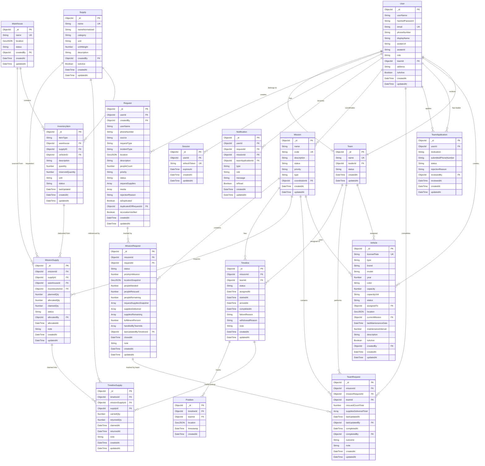

# Entity Relationship Diagram

> Mô hình dữ liệu cho hệ thống Flood Rescue

---

## ERD Diagram

---

## Entity Definitions

### Core Entities

#### User

Người dùng hệ thống với các roles: Citizen, Rescue Team, Coordinator, Admin, Manager.

| Field            | Type      | Description                                       |
| ---------------- | --------- | ------------------------------------------------- |
| `_id`            | ObjectId  | Primary key                                       |
| `userName`       | String    | Username đăng nhập                                |
| `email`          | String    | Email (unique)                                    |
| `hashedPassword` | String    | Mật khẩu đã hash                                  |
| `phoneNumber`    | String    | Số điện thoại (sparse unique)                     |
| `displayName`    | String    | Tên hiển thị                                      |
| `avatarUrl`      | String    | Link CDN avatar                                   |
| `address`        | String    | Địa chỉ                                           |
| `role`           | Enum      | Citizen, Rescue Team, Coordinator, Admin, Manager |
| `teamId`         | ObjectId? | FK → Team (nullable, chỉ cho Rescue Team)         |
| `isActive`       | Boolean   | Trạng thái tài khoản                              |

---

#### Team

Đội cứu hộ. Mỗi User chỉ thuộc 1 Team tại 1 thời điểm.

| Field      | Type     | Description             |
| ---------- | -------- | ----------------------- |
| `_id`      | ObjectId | Primary key             |
| `name`     | String   | Tên team (unique)       |
| `leaderId` | ObjectId | FK → User (team leader) |
| `status`   | Enum     | AVAILABLE, BUSY         |

> [!NOTE]
> **Team Capacity:** Một Rescue Team có thể xử lý nhiều nhiệm vụ song song tùy theo điều phối của Rescue Coordinator. Hệ thống không giới hạn số lượng Timeline active per Team.

---

#### Request

Yêu cầu cứu hộ từ Citizen.

| Field                   | Type          | Description                                                                                   |
| ----------------------- | ------------- | --------------------------------------------------------------------------------------------- |
| `_id`                   | ObjectId      | Primary key                                                                                   |
| `userId`                | ObjectId?     | FK → User (Citizen yêu cầu, nullable cho unregistered citizens)                               |
| `createdBy`             | ObjectId      | FK → User (người tạo request thực tế - Citizen hoặc Coordinator)                              |
| `userName`              | String        | Tên người gửi                                                                                 |
| `phoneNumber`           | String        | Số điện thoại người yêu cầu                                                                   |
| `source`                | Enum          | CITIZEN, COORDINATOR - nguồn tạo request                                                      |
| `requestType`           | Enum          | Rescue, Relief                                                                                |
| `incidentType`          | Enum          | Flood, Trapped, Injured, Landslide, Other                                                     |
| `location`              | GeoJSON Point | `{ type: "Point", coordinates: [lng, lat] }`                                                  |
| `description`           | String        | Mô tả tình huống                                                                              |
| `peopleCount`           | Number        | Số người cần cứu (1-100)                                                                      |
| `priority`              | Enum          | Critical, High, Normal                                                                        |
| `status`                | Enum          | SUBMITTED, VERIFIED, REJECTED, IN_PROGRESS, PARTIALLY_FULFILLED, FULFILLED, CLOSED, CANCELLED |
| `requestSupplies`       | Array         | `[{ name: String, requestedQty: Number }]` - Supplies cần (ref by name)                       |
| `media`                 | Array         | `[{ imageUrl: String, description: String, uploadedAt: DateTime }]` - Media với metadata      |
| `rejectionReason`       | String?       | Lý do từ chối (nếu status = REJECTED)                                                        |
| `isDuplicated`          | Boolean       | Coordinator đánh dấu nếu request trùng (default: false)                                       |
| `duplicatedOfRequestId` | ObjectId?     | FK → Request (request gốc nếu là duplicate)                                                   |
| `isLocationVerified`    | Boolean       | Coordinator verify location chính xác (default: false)                                        |

**Business Rules:**

> [!IMPORTANT]
> **Request Limit:** Một Citizen chỉ được tạo Request mới khi request hiện tại đã ở terminal states (`CLOSED` hoặc `CANCELLED`). Hệ thống validate và reject request mới nếu vi phạm.

> [!NOTE]
> **Priority Assignment:** Priority flag được Coordinator gắn thủ công khi verify request. Thứ tự ưu tiên xử lý:
>
> 1. Mức độ khẩn cấp (priority)
> 2. Số người bị ảnh hưởng (peopleCount)
> 3. Thời gian tạo (createdAt)

> [!NOTE]
> **Duplicate Detection:** Coordinator đánh dấu duplicate thủ công (`isDuplicated = true`). Request duplicate vẫn được verify và có status giống request chính. _Future enhancement: Hệ thống đề xuất duplicate dựa trên location + time + citizen._

> [!NOTE]
> **On Behalf Creation:** Coordinator có thể tạo Request thay mặt Citizen. Request này có `userId` của Coordinator và flow verify giống Request thường.

---

#### Mission

Nhiệm vụ cứu hộ được tạo bởi Coordinator.

| Field           | Type        | Description                                                           |
| --------------- | ----------- | --------------------------------------------------------------------- |
| `_id`           | ObjectId    | Primary key                                                           |
| `name`          | String      | Tên mission (required)                                                |
| `code`          | String      | Mã mission auto-generated (unique, `MS-DDMMYY-SEQ`)                   |
| `description`   | String      | Mô tả mission                                                         |
| `status`        | Enum        | **DRAFT**, PLANNED, IN_PROGRESS, PAUSED, PARTIAL, COMPLETED, ABORTED  |
| `priority`      | Enum        | Critical, High, Normal                                                |
| `type`          | Enum        | RESCUE, RELIEF                                                        |
| `coordinatorId` | ObjectId    | FK → User (coordinator tạo mission)                                   |

**Mission Status Lifecycle (UI-driven flow):**

| Status        | Ý nghĩa                                                                      |
| :------------ | :--------------------------------------------------------------------------- |
| `DRAFT`       | Coordinator đang lên kế hoạch: kéo request vào, ghép team; chưa thông báo   |
| `PLANNED`     | Start Mission đã bấm; notifications gửi tới teams; chờ team accept đầu tiên  |
| `IN_PROGRESS` | Mission đã start; ít nhất 1 timeline đang EN_ROUTE / ON_SITE                 |
| `PAUSED`      | Tạm dừng                                                                     |
| `PARTIAL`     | Hoàn thành một phần (cần thêm timeline)                                      |
| `COMPLETED`   | Hoàn tất toàn bộ requests                                                    |
| `ABORTED`     | Huỷ mission                                                                  |

**Business Rules:**

> [!NOTE]
> **Multi-Request Mission:** Một Mission có thể phục vụ nhiều Requests. Khi coordinator kéo một Request vào mission, một `MissionRequest` (status=`PENDING`) được tạo để theo dõi fulfillment của request đó. Khi coordinator ghép một Team vào mission, một Timeline (status=`PLANNED`) được tạo để đại diện cho lần tham gia của team đó.

> [!NOTE]
> **Start Mission:** Khi coordinator bấm "Start", toàn bộ Timeline `PLANNED` của mission đó chuyển sang `ASSIGNED`, notification được gửi tới từng team, mission chuyển sang `PLANNED` (chờ team accept) → `IN_PROGRESS` (khi team đầu tiên accept).

---

#### MissionRequest

Lớp trung gian theo dõi **fulfillment từng Request trong Mission**. Mỗi MissionRequest = 1 Mission × 1 Request, theo dõi cả people rescue lẫn supply delivery.

| Field                     | Type       | Description                                                                   |
| ------------------------- | ---------- | ----------------------------------------------------------------------------- |
| `_id`                     | ObjectId   | Primary key                                                                   |
| `missionId`               | ObjectId   | FK → Mission                                                                  |
| `requestId`               | ObjectId   | FK → Request                                                                  |
| `status`                  | Enum       | PENDING, IN_PROGRESS, PARTIAL, FULFILLED, CLOSED, DROPPED                     |
| `priorityInMission`       | Number?    | Thứ tự ưu tiên trong mission (optional)                                       |
| `locationSnapshot`        | GeoJSON?   | Snapshot vị trí request lúc thêm vào mission                                  |
| `peopleNeeded`            | Number     | Số người cần cứu (copy từ Request.peopleCount lúc tạo)                        |
| `peopleRescued`           | Number     | Số người đã cứu được (cộng dồn từ các Timeline trong cùng mission)            |
| `peopleRemaining`         | Number     | `peopleNeeded − peopleRescued`                                                |
| `requestSuppliesSnapshot` | Array      | `[{supplyId, requestedQty}]` – Snapshot supplies cần lúc tạo                  |
| `suppliesDelivered`       | Array      | `[{supplyId, deliveredQty}]` – Tổng supplies đã giao (cộng dồn)              |
| `suppliesRemaining`       | Array      | `[{supplyId, remainingQty}]` – Chênh lệch còn thiếu                          |
| `fulfillmentPercent`      | Number     | 0–100 – Phần trăm hoàn thành tổng hợp                                        |
| `handledByTeamIds`        | ObjectId[] | Các team đã đóng góp vào xử lý request này trong mission                     |
| `lastUpdatedByTimelineId` | ObjectId?  | FK → Timeline – Timeline cập nhật gần nhất                                   |
| `closedAt`                | DateTime?  | Thời điểm đóng (FULFILLED hoặc CLOSED)                                        |
| `note`                    | String?    | Ghi chú                                                                       |
| `createdAt`               | DateTime   |                                                                               |
| `updatedAt`               | DateTime   |                                                                               |

**MissionRequest Status Lifecycle:**

| Status        | Ý nghĩa                                                                                   |
| :------------ | :---------------------------------------------------------------------------------------- |
| `PENDING`     | Request đã thêm vào mission, chưa có team nào accept                                       |
| `IN_PROGRESS` | Có ít nhất 1 Timeline đang active (EN_ROUTE / ON_SITE) xử lý request này trong mission    |
| `PARTIAL`     | Timeline completed với kết quả partial (còn người hoặc supplies chưa đủ)                  |
| `FULFILLED`   | Toàn bộ people rescued và supplies delivered đầy đủ theo request                           |
| `CLOSED`      | Coordinator đóng thủ công (kể cả khi chưa fulfilled 100%)                                 |
| `DROPPED`     | Coordinator loại request khỏi mission (không xử lý nữa)                                   |

**Business Rules:**

> [!NOTE]
> **Fulfillment Tracking:** `peopleRescued` và `suppliesDelivered` được cộng dồn mỗi khi một Timeline COMPLETED hoặc PARTIAL trong cùng mission. `fulfillmentPercent` được tính lại tự động sau mỗi cập nhật.

> [!NOTE]
> **Multi-Team per Request:** Nhiều Timeline (nhiều team) trong cùng mission có thể cùng đóng góp vào một MissionRequest. `handledByTeamIds` ghi nhận tất cả teams đã tham gia.

---

#### Timeline

Đại diện cho **một lần team tham gia thực thi mission**. Mỗi Timeline = 1 Team × 1 Mission (không còn gắn trực tiếp với Request).

| Field              | Type     | Description                                                                            |
| ------------------ | -------- | -------------------------------------------------------------------------------------- |
| `_id`              | ObjectId | Primary key                                                                            |
| `missionId`        | ObjectId | FK → Mission                                                                           |
| `teamId`           | ObjectId | FK → Team                                                                              |
| `status`           | Enum     | **PLANNED**, ASSIGNED, EN_ROUTE, ON_SITE, COMPLETED, PARTIAL, FAILED, WITHDRAWN, CANCELLED |
| `assignedAt`       | DateTime | Thời điểm mission start (PLANNED → ASSIGNED); null khi còn ở PLANNED                  |
| `startedAt`        | DateTime | Thời điểm team accept (ASSIGNED → EN_ROUTE)                                            |
| `arrivedAt`        | DateTime | Thời điểm team đến nơi (EN_ROUTE → ON_SITE)                                            |
| `completedAt`      | DateTime | Thời điểm hoàn thành/thất bại                                                          |
| `failureReason`    | String?  | Lý do thất bại                                                                         |
| `withdrawalReason` | String?  | Lý do rút/từ chối                                                                      |
| `note`             | String?  | Ghi chú                                                                                |

**Timeline Status Lifecycle:**

| Status      | Ý nghĩa                                                                              |
| :---------- | :----------------------------------------------------------------------------------- |
| `PLANNED`   | Coordinator đã ghép team vào mission, mission chưa start; team **chưa được thông báo**  |
| `ASSIGNED`  | Mission đã start; team được thông báo, chờ team accept                               |
| `EN_ROUTE`  | Team accepted; đang di chuyển đến hiện trường                                        |
| `ON_SITE`   | Team đã đến và đang xử lý                                                            |
| `COMPLETED` | Hoàn thành toàn bộ                                                                   |
| `PARTIAL`   | Hoàn thành một phần                                                                  |
| `FAILED`    | Thất bại                                                                             |
| `WITHDRAWN` | Team từ chối sau khi được thông báo                                                  |
| `CANCELLED` | Coordinator huỷ trước khi team hành động                                             |

---

#### Position

Vị trí theo thời gian thực của Team trong quá trình thực hiện Timeline.

| Field        | Type          | Description                                  |
| ------------ | ------------- | -------------------------------------------- |
| `_id`        | ObjectId      | Primary key                                  |
| `timelineId` | ObjectId      | FK → Timeline                                |
| `teamId`     | ObjectId      | FK → Team                                    |
| `location`   | GeoJSON Point | `{ type: "Point", coordinates: [lng, lat] }` |
| `timestamp`  | DateTime      | Thời điểm ghi nhận                           |

**Tracking rules:**

- Ghi nhận mỗi **30 giây** khi Timeline ở trạng thái `EN_ROUTE` hoặc `ON_SITE`
- **Retention**: 60 ngày (sử dụng MongoDB TTL index)

---

### Supply Management Entities

#### Supply

Danh mục supplies chuẩn của hệ thống.

| Field            | Type     | Description                                      |
| ---------------- | -------- | ------------------------------------------------ |
| `_id`            | ObjectId | Primary key                                      |
| `name`           | String   | Tên supply (unique)                              |
| `nameNormalized` | String   | Tên không dấu để search                          |
| `category`       | Enum     | FOOD, WATER, MEDICAL, CLOTHING, EQUIPMENT, OTHER |
| `unit`           | String   | Đơn vị tính (chai, thùng, kg, cái...)            |
| `unitWeight`     | Number   | Trọng lượng/đơn vị (kg) - required               |
| `description`    | String   | Mô tả                                            |
| `createdBy`      | ObjectId | FK → User (Manager tạo supply)                   |
| `isActive`       | Boolean  | Còn sử dụng không                                |

---

#### Warehouse

Kho hàng cứu trợ.

| Field       | Type          | Description                  |
| ----------- | ------------- | ---------------------------- |
| `_id`       | ObjectId      | Primary key                  |
| `name`      | String        | Tên kho (unique)             |
| `location`  | GeoJSON Point | Vị trí kho                   |
| `status`    | Enum          | FULL, EMPTY, MAINTENANCE     |
| `createdBy` | ObjectId      | FK → User (Manager tạo kho)  |

---

#### InventoryItem

Tồn kho của từng supply tại warehouse.

| Field              | Type     | Description                                  |
| ------------------ | -------- | -------------------------------------------- |
| `_id`              | ObjectId | Primary key                                  |
| `itemType`         | Enum     | SUPPLY, VEHICLE - loại item trong inventory  |
| `warehouse`        | ObjectId | FK → Warehouse                               |
| `supplyID`         | ObjectId | FK → Supply (nếu itemType = SUPPLY)          |
| `vehicleID`        | ObjectId | FK → Vehicle (nếu itemType = VEHICLE)        |
| `description`      | String   | Mô tả item                                   |
| `quantity`         | Number   | Số lượng hiện có                             |
| `reservedQuantity` | Number   | Số lượng đã đặt (chờ xuất)                   |
| `unit`             | String   | Đơn vị tính                                  |
| `status`           | Enum     | ACTIVE, OUT_OF_STOCK, RESERVED               |
| `lastUpdated`      | DateTime | Lần cập nhật cuối                            |

> **Available = quantity - reservedQuantity**
> **Note:** InventoryItem có thể chứa cả Supply và Vehicle, phân biệt bằng `itemType`

---

#### MissionSupply

Tracking tổng số lượng supply được yêu cầu và xuất kho cho một Mission.

| Field             | Type     | Description                               |
| ----------------- | -------- | ----------------------------------------- |
| `_id`             | ObjectId | Primary key                               |
| `missionId`       | ObjectId | FK → Mission                              |
| `supplyId`        | ObjectId | FK → Supply                               |
| `warehouseId`     | ObjectId | FK → Warehouse (nguồn xuất, nullable)     |
| `inventoryItemId` | ObjectId | FK → InventoryItem (vật phẩm tồn kho)     |
| `plannedQty`      | Number   | Số lượng dự định (tổng từ MissionRequests)|
| `allocatedQty`    | Number   | Số lượng thực tế Manager reserve          |
| `claimedQty`      | Number   | Sum lượng team đã lấy (carry)             |
| `status`          | Enum     | REQUESTED, ALLOCATED, FULLY_CLAIMED, RETURNED |
| `allocatedBy`     | ObjectId | FK → User (Manager)                       |
| `allocatedAt`     | DateTime | Thời điểm reserve/allocate                 |
| `note`            | String?  | Ghi chú                                   |

---

#### TimelineSupply

Tracking việc lấy (pickup) và trả (return) supply cho từng Team trong Mission. Distribution được track qua `TeamRequest`.

| Field             | Type     | Description                               |
| ----------------- | -------- | ----------------------------------------- |
| `_id`             | ObjectId | Primary key                               |
| `timelineId`      | ObjectId | FK → Timeline                             |
| `missionSupplyId` | ObjectId | FK → MissionSupply (nguồn xuất)           |
| `supplyId`        | ObjectId | FK → Supply (denormalized for query ease) |
| `carriedQty`      | Number   | Số lượng thực tế mang theo (Team claim)   |
| `returnedQty`     | Number   | Số lượng trả về kho (`carriedQty` - tổng phát)|
| `claimedAt`       | DateTime | Thời điểm team xác nhận lấy hàng          |
| `returnedAt`      | DateTime | Thời điểm team trả hàng dư                |
| `note`            | String?  | Ghi chú                                   |

---

### Supporting Entities

#### Session

Phiên đăng nhập của User.

| Field          | Type     | Description                   |
| -------------- | -------- | ----------------------------- |
| `_id`          | ObjectId | Primary key                   |
| `userId`       | ObjectId | FK → User                     |
| `refreshToken` | String   | Refresh token (unique)        |
| `expiresAt`    | DateTime | Thời điểm hết hạn (TTL index) |

---

#### Notification

Thông báo hệ thống.

| Field               | Type     | Description                                                                     |
| ------------------- | -------- | ------------------------------------------------------------------------------- |
| `_id`               | ObjectId | Primary key                                                                     |
| `userId`            | ObjectId | FK → User                                                                       |
| `requestId`         | ObjectId | FK → Request (optional, nếu notification liên quan đến request)                |
| `missionId`         | ObjectId | FK → Mission (optional, nếu notification liên quan đến mission)                |
| `teamApplicationId` | ObjectId | FK → TeamApplication (optional, nếu notification liên quan đến team application) |
| `type`              | Enum     | SUBMITTED, ACCEPTED, REJECTED, ONGOING, IN_PROGRESS, COMPLETED, CANCELLED, WITHDRAWN |
| `role`              | Enum     | CITIZEN, COORDINATOR, TEAM_LEADER, TEAM_MEMBER, ADMIN, MANAGER                 |
| `message`           | String   | Nội dung thông báo                                                              |
| `isRead`            | Boolean  | Đã đọc chưa                                                                     |

---

#### TeamRequest

Tracking tiến độ thực tế của từng team cho từng request trong mission. Entity này ghi nhận chi tiết số người cứu được và supplies phát ra bởi mỗi team.

| Field                    | Type     | Description                                                |
| ------------------------ | -------- | ---------------------------------------------------------- |
| `_id`                    | ObjectId | Primary key                                                |
| `missionId`              | ObjectId | FK → Mission                                               |
| `missionRequestId`       | ObjectId | FK → MissionRequest                                        |
| `teamId`                 | ObjectId | FK → Team                                                  |
| `rescuedCountTotal`      | Number   | Tổng số người team này đã cứu cho request này (default: 0) |
| `suppliesDeliveredTotal` | Array    | `[{name: String, deliveredQty: Number}]` - Supplies đã phát |
| `lastUpdatedAt`          | DateTime | Thời điểm cập nhật tiến độ gần nhất                       |
| `lastUpdatedBy`          | ObjectId | FK → User - người cập nhật gần nhất                        |
| `completedAt`            | DateTime | Thời điểm hoàn tất (khi team complete mission)            |
| `completedBy`            | ObjectId | FK → User - người đánh dấu complete                        |
| `outcome`                | Enum     | COMPLETED, PARTIAL - kết quả hoàn thành                    |
| `note`                   | String   | Ghi chú (max 1000 chars)                                   |

**Business Rules:**

> [!NOTE]
> **Outcome Calculation:** Khi team complete mission, outcome được tính tự động:
> - `COMPLETED`: Nếu `rescuedCountTotal >= peopleNeeded` (từ MissionRequest)
> - `PARTIAL`: Nếu có tiến độ nhưng chưa đủ, hoặc không có tiến độ nào

> [!NOTE]
> **Progress Tracking:** TeamRequest được cập nhật mỗi khi team báo cáo tiến độ (update progress). Dữ liệu này được aggregate lên MissionRequest để tính tổng fulfillment.

> [!NOTE]
> **Auto-Complete Logic:** Khi coordinator hoặc team bấm "Complete Mission", tất cả TeamRequest chưa hoàn thành sẽ được tự động complete với outcome dựa trên tiến độ hiện tại.

> [!IMPORTANT]
> **Unique Constraint:** Mỗi combination (missionRequestId, teamId) chỉ có 1 TeamRequest duy nhất.

---

#### Vehicle

Quản lý phương tiện cứu hộ của hệ thống.

| Field                 | Type          | Description                                           |
| --------------------- | ------------- | ----------------------------------------------------- |
| `_id`                 | ObjectId      | Primary key                                           |
| `licensePlate`        | String        | Biển số xe (unique, uppercase)                        |
| `type`                | Enum          | AMBULANCE, RESCUE_BOAT, FIRE_TRUCK, TRUCK, VAN, MOTORCYCLE, OTHERS |
| `brand`               | String        | Hãng xe                                               |
| `model`               | String        | Model xe                                              |
| `year`                | Number        | Năm sản xuất                                          |
| `color`               | String        | Màu sắc                                               |
| `capacity`            | Number        | Sức chứa (min: 1)                                     |
| `capacityUnit`        | Enum          | PERSONS, LITERS, TONS, KG - đơn vị sức chứa           |
| `status`              | Enum          | ACTIVE, IN_USE, MAINTENANCE, OUT_OF_SERVICE           |
| `assignedTo`          | ObjectId      | FK → Team - team đang sử dụng                         |
| `location`            | GeoJSON Point | Vị trí hiện tại của xe                                |
| `currentMission`      | ObjectId      | FK → Mission - mission đang thực hiện                 |
| `lastMaintenanceDate` | DateTime      | Ngày bảo dưỡng gần nhất                               |
| `maintenanceInterval` | Number        | Chu kỳ bảo dưỡng (ngày, default: 90)                  |
| `description`         | String        | Mô tả thêm                                            |
| `isActive`            | Boolean       | Còn hoạt động không (default: true)                   |
| `createdBy`           | ObjectId      | FK → User (Manager tạo vehicle)                       |

**Vehicle Status Lifecycle:**

| Status            | Ý nghĩa                                      |
| :---------------- | :------------------------------------------- |
| `ACTIVE`          | Sẵn sàng sử dụng                             |
| `IN_USE`          | Đang được sử dụng trong mission              |
| `MAINTENANCE`     | Đang bảo dưỡng                               |
| `OUT_OF_SERVICE`  | Hỏng hóc, không thể sử dụng                  |

**Business Rules:**

> [!NOTE]
> **Assignment Tracking:** Khi vehicle được assign cho team trong mission, `assignedTo` và `currentMission` được cập nhật. Status chuyển sang `IN_USE`.

> [!NOTE]
> **Maintenance Reminder:** Hệ thống có thể tính toán maintenance due date dựa trên `lastMaintenanceDate + maintenanceInterval`.

---

#### TeamApplication

Đơn xin gia nhập đội cứu hộ từ Citizen.

| Field                  | Type     | Description                                    |
| ---------------------- | -------- | ---------------------------------------------- |
| `_id`                  | ObjectId | Primary key                                    |
| `userId`               | ObjectId | FK → User (Citizen nộp đơn)                    |
| `motivation`           | String   | Động lực xin gia nhập (required)               |
| `submittedPhoneNumber` | String   | Số điện thoại submit (required)                |
| `status`               | Enum     | PENDING, APPROVED, REJECTED, WITHDRAWN         |
| `rejectionReason`      | String   | Lý do từ chối (nếu status = REJECTED)          |
| `reviewedBy`           | ObjectId | FK → User (Admin/Manager review đơn)           |
| `reviewedAt`           | DateTime | Thời điểm review                               |

**Status Lifecycle:**

| Status      | Ý nghĩa                                |
| :---------- | :------------------------------------- |
| `PENDING`   | Đơn mới submit, chờ review             |
| `APPROVED`  | Đơn được chấp nhận, user thành Rescue Team |
| `REJECTED`  | Đơn bị từ chối                         |
| `WITHDRAWN` | Citizen tự rút đơn                     |

**Business Rules:**

> [!IMPORTANT]
> **Unique Constraint:** Mỗi user chỉ có thể có 1 application ở trạng thái `PENDING` tại một thời điểm. Partial unique index: `{userId: 1, status: 1}` với filter `status = PENDING`.

> [!NOTE]
> **Approval Process:** Khi application được APPROVED, user's role được cập nhật từ `Citizen` thành `Rescue Team` và được assign vào một team.

> [!NOTE]
> **Notification:** Mỗi thay đổi status sẽ gửi notification cho user qua `teamApplicationId` reference.

---

## Relationships Summary

| Relationship                  | Cardinality | Description                                                              |
| ----------------------------- | ----------- | ------------------------------------------------------------------------ |
| User → Team                   | N:1         | User thuộc 0-1 team                                                      |
| Team → User (leader)          | 1:1         | Team có 1 leader                                                         |
| User → Request (created)      | 1:N         | User tạo nhiều requests (via createdBy)                                  |
| User → Request (owner)        | 1:N         | Citizen sở hữu nhiều requests (via userId)                               |
| Mission → MissionRequest      | 1:N         | 1 Mission gom nhiều Requests thông qua MissionRequest                    |
| Request → MissionRequest      | 1:N         | 1 Request được theo dõi trong nhiều Missions qua MissionRequest          |
| MissionRequest → TeamRequest  | 1:N         | 1 MissionRequest được thực hiện bởi nhiều teams qua TeamRequest          |
| Team → TeamRequest            | 1:N         | Team thực hiện nhiều TeamRequests                                        |
| Mission → TeamRequest         | 1:N         | Mission chứa nhiều TeamRequests                                          |
| User → TeamRequest (updated)  | 1:N         | User cập nhật nhiều TeamRequests (via lastUpdatedBy, completedBy)        |
| Mission → Timeline            | 1:N         | Mission có nhiều timelines (1 per team participation)                    |
| Team → Timeline               | 1:N         | Team được assign nhiều timelines                                         |
| Timeline → Position           | 1:N         | Timeline có nhiều positions (planned feature)                            |
| Mission → MissionSupply       | 1:N         | Mission yêu cầu nhiều loại supplies                                      |
| Supply → MissionSupply        | 1:N         | Supply được cấp phát cho nhiều missions                                  |
| Warehouse → MissionSupply     | 1:N         | Warehouse xuất supply cho nhiều missions                                 |
| MissionSupply → TimelineSupply| 1:N         | Nguồn cung của mission cấp cho nhiều teams                               |
| Timeline → TimelineSupply     | 1:N         | Timeline ghi nhận nhiều lượt nhận trả supply                             |
| Supply → TimelineSupply       | 1:N         | Supply được pickup bởi nhiều timelines                                   |
| Supply → InventoryItem        | 1:N         | Supply có inventory tại nhiều warehouses                                 |
| Vehicle → InventoryItem       | 1:N         | Vehicle có inventory records                                             |
| Warehouse → InventoryItem     | 1:N         | Warehouse chứa nhiều inventory items                                     |
| Team → Vehicle                | 1:N         | Team được assign nhiều vehicles (via assignedTo)                         |
| Mission → Vehicle             | 1:N         | Mission sử dụng nhiều vehicles (via currentMission)                      |
| User → Vehicle (created)      | 1:N         | User (Manager) tạo nhiều vehicles                                        |
| User → TeamApplication        | 1:N         | User (Citizen) nộp nhiều applications                                    |
| User → TeamApplication (reviewer) | 1:N     | User (Admin/Manager) review nhiều applications                           |
| User → Session                | 1:N         | User có nhiều sessions                                                   |
| User → Notification           | 1:N         | User nhận nhiều notifications                                            |
| Request → Notification        | 1:N         | Request có nhiều notifications liên quan                                 |
| Mission → Notification        | 1:N         | Mission có nhiều notifications liên quan                                 |
| TeamApplication → Notification| 1:N         | TeamApplication có nhiều notifications liên quan                         |
| User → Supply (created)       | 1:N         | User (Manager) tạo nhiều supplies                                        |
| User → Warehouse (created)    | 1:N         | User (Manager) tạo nhiều warehouses                                      |

---

## References

- [Rescue_flow_2.2.md](./flows/Rescue_flow_2.2.md) - Flow diagrams (cứu hộ)
- [Relief_flow_1.1.md](./flows/Relief_flow_1.1.md) - Flow diagrams (cứu trợ)
- [rules.md](./flows/rules.md) - Derive rules for statuses
