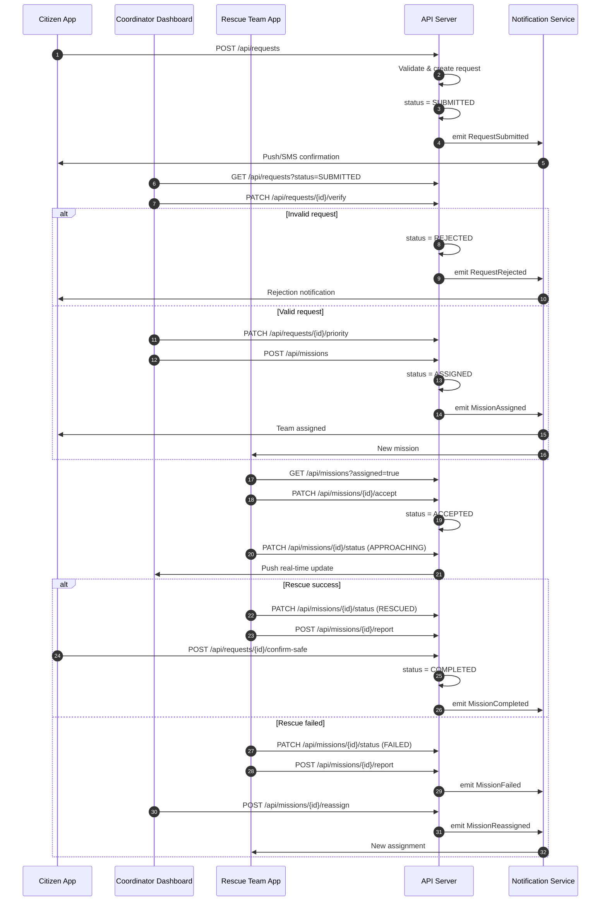
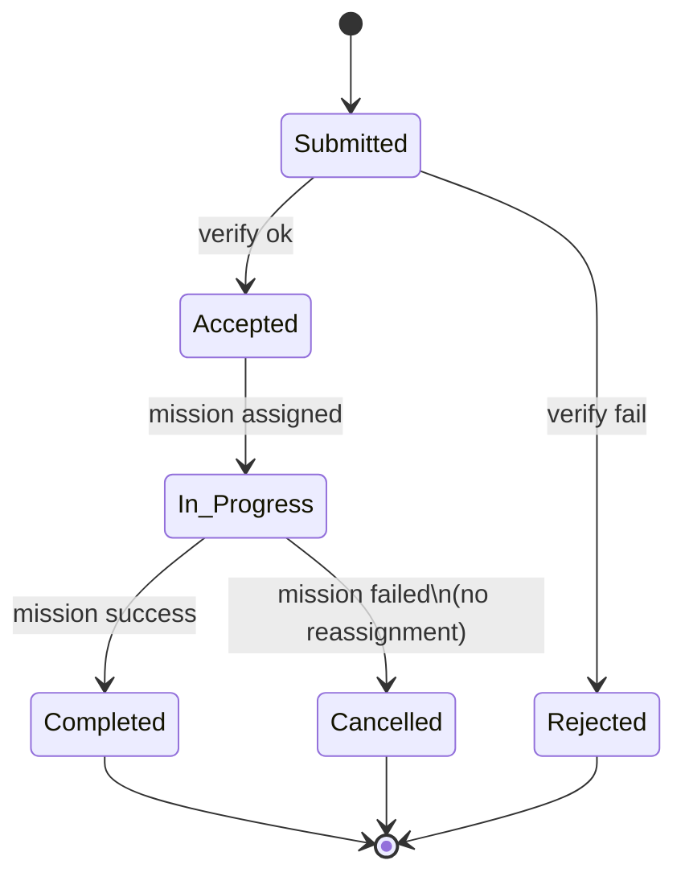

## Sequence Diagram của luồng rescue

## State Diagram của request

🟦 Submitted
Ai set: Citizen / System
Ý nghĩa:
Yêu cầu đã được gửi, chưa qua xác minh
Cho phép:
Coordinator xem
Verify / Reject
Không cho phép:
Assign team
Tạo mission

🟨 Accepted
Ai set: Coordinator
Ý nghĩa:
Request hợp lệ, được chấp nhận về mặt nghiệp vụ
⚠️ Chưa có team
Cho phép:
Set priority
Assign rescue team
Không cho phép:
Rescue team thao tác
👉 Accepted = business approval, không phải execution

🟥 Rejected
Ai set: Coordinator
Ý nghĩa:
Request không hợp lệ / spam / sai thông tin
Đặc điểm:
Trạng thái kết thúc (terminal)
Không thể reopen

🟦 In Progress
Ai set: System (khi mission được assign)
Ý nghĩa:
Đã có ít nhất 1 mission active xử lý request
Trigger vào trạng thái này:
Mission được tạo + assign cho team
Cho phép:
Theo dõi real-time
Reassign mission
Update mission status

🟩 Completed
Ai set: System
Ý nghĩa:
Request đã được xử lý thành công
(Citizen xác nhận an toàn hoặc mission rescued)
Điều kiện bắt buộc:
Mission = RESCUED
Citizen confirm safe (nếu có)
Terminal state

⚫ Cancelled
Ai set: System / Coordinator
Ý nghĩa:
Request không thể hoàn thành dù đã bắt đầu xử lý
Ví dụ lý do:
Điều kiện quá nguy hiểm
Không thể tiếp cận
Mission FAILED và không reassign

⚠️ Khác Rejected ở chỗ:
Rejected → chưa từng xử lý
Cancelled → đã xử lý nhưng thất bại

### Validation rules:

- Submitted chỉ có thể chuyển sang Accepted hoặc Rejected
- Accepted bắt buộc phải chuyển sang In Progress thông qua assign mission
- In Progress chỉ kết thúc bằng Completed hoặc Cancelled
- Không được phép update ngược trạng thái
