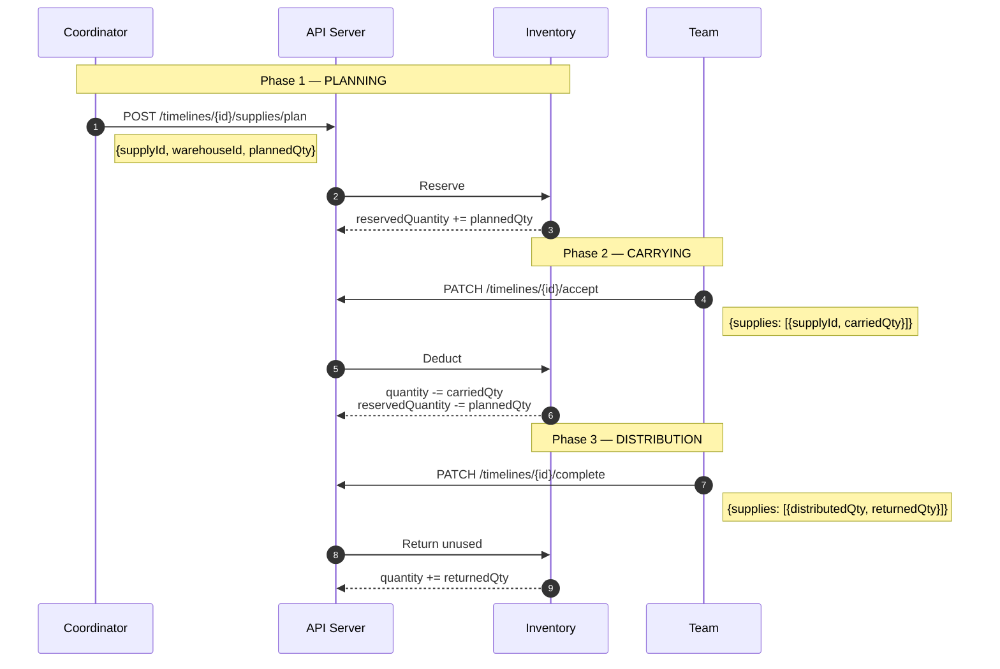

# Supply Management

> Hệ thống quản lý supplies cho Mission/Timeline, áp dụng cho cả Rescue và Relief flows.

---

## 1. Overview

Supply Management cho phép tracking supplies qua **3 giai đoạn**:

```
┌──────────────┐    ┌──────────────┐    ┌──────────────┐
│   PLANNING   │ →  │   CARRYING   │ →  │ DISTRIBUTION │
│  (Reserve)   │    │   (Deduct)   │    │   (Report)   │
└──────────────┘    └──────────────┘    └──────────────┘
     Coordinator          Team              Team
     assigns              accepts           completes
```

Ngoài tracking theo Timeline, hệ thống còn có lớp tổng hợp theo `MissionRequest`:

- `requestSuppliesSnapshot`: snapshot nhu cầu supply của request tại thời điểm add vào mission.
- `suppliesDelivered`: tổng số supply đã deliver từ các timeline thuộc cùng mission.
- Khi `suppliesDelivered` đạt snapshot (all items), `MissionRequest` có thể chuyển `FULFILLED`.

---

## 2. Entities

### 2.1 Supply Catalog

| Field        | Type   | Description                                      |
| ------------ | ------ | ------------------------------------------------ |
| `name`       | String | Tên supply (unique)                              |
| `category`   | Enum   | FOOD, WATER, MEDICAL, CLOTHING, EQUIPMENT, OTHER |
| `unit`       | String | Đơn vị tính                                      |
| `unitWeight` | Number | Trọng lượng/đơn vị (kg)                          |

### 2.2 Warehouse & Inventory

| Field              | Description                   |
| ------------------ | ----------------------------- |
| `quantity`         | Số lượng hiện có              |
| `reservedQuantity` | Số lượng đã đặt (chờ xuất)    |
| **Available**      | `quantity - reservedQuantity` |

### 2.3 TimelineSupply

| Field            | Description            |
| ---------------- | ---------------------- |
| `plannedQty`     | Coordinator dự định    |
| `carriedQty`     | Team thực tế mang theo |
| `distributedQty` | Đã phát/sử dụng        |
| `returnedQty`    | Trả về kho             |

### 2.4 MissionRequest Supply Fulfillment

| Field                      | Description                                                     |
| -------------------------- | --------------------------------------------------------------- |
| `requestSuppliesSnapshot`  | Nhu cầu supply snapshot từ Request khi mission planning         |
| `suppliesDelivered`        | Tổng quantity thực phát từ các Timeline thuộc mission           |
| `status`                   | `PENDING/IN_PROGRESS/PARTIAL/FULFILLED` theo mức độ đáp ứng     |

> `MissionRequest` là lớp đánh giá fulfillment; `TimelineSupply` là lớp thực thi chi tiết theo từng team.

---

## 3. Tracking Flow



---

## 4. Inventory Rules

| Event                | Action                                                     |
| -------------------- | ---------------------------------------------------------- |
| Coordinator plans    | `reservedQuantity += plannedQty`                           |
| Team accepts (carry) | `quantity -= carriedQty`, `reservedQuantity -= plannedQty` |
| Timeline cancelled   | `reservedQuantity -= plannedQty` (release)                 |
| Team returns unused  | `quantity += returnedQty`                                  |

> **Validation**: `carriedQty <= Available` at accept time

---

## 5. API Endpoints

### Supply Catalog (Manager)

| Method  | Endpoint         | Actor   | Description   |
| ------- | ---------------- | ------- | ------------- |
| `GET`   | `/supplies`      | Manager | List supplies |
| `POST`  | `/supplies`      | Manager | Create supply |
| `PATCH` | `/supplies/{id}` | Manager | Update supply |

### Warehouse & Inventory (Manager)

| Method  | Endpoint                     | Actor   | Description     |
| ------- | ---------------------------- | ------- | --------------- |
| `GET`   | `/warehouses`                | Manager | List warehouses |
| `GET`   | `/warehouses/{id}/inventory` | Manager | Get inventory   |
| `PATCH` | `/inventory/{id}`            | Manager | Restock         |

### Timeline Supplies

| Method  | Endpoint                        | Actor       | Description       |
| ------- | ------------------------------- | ----------- | ----------------- |
| `POST`  | `/timelines/{id}/supplies/plan` | Coordinator | Plan supplies     |
| `PUT`   | `/timelines/{id}/supplies/plan` | Coordinator | Update plan       |
| `PATCH` | `/timelines/{id}/accept`        | Team        | Accept + carry    |
| `PATCH` | `/timelines/{id}/complete`      | Team        | Complete + report |

### Mission Summary (Real-time Aggregation)

| Method | Endpoint                  | Actor                | Description             |
| ------ | ------------------------- | -------------------- | ----------------------- |
| `GET`  | `/missions/{id}/supplies` | Manager, Coordinator | Get aggregated supplies |

---

## 6. References

- [ERD.md](./ERD.md) - Entity definitions
- [Rescue_flow_2.2.md](./flows/Rescue_flow_2.2.md) - Rescue flow với supply tracking
- [Relief_flow_1.1.md](./flows/Relief_flow_1.1.md) - Relief flow
