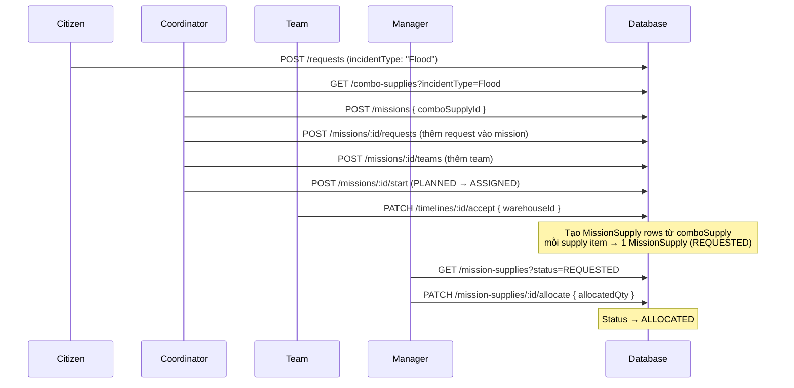

# ComboSupply Flow — Implementation Summary

## Luồng hoàn chỉnh



## API Endpoints

### 1. ComboSupply (Manager quản lý)
| Method | Endpoint | Role | Mô tả |
|--------|----------|------|-------|
| `POST` | `/api/combo-supplies` | Manager, Admin | Tạo combo mới |
| `GET` | `/api/combo-supplies?incidentType=Flood` | Tất cả | Lấy combo theo incident type |
| `GET` | `/api/combo-supplies/:id` | Manager, Admin, Team, Coord | Lấy chi tiết combo |
| `PUT` | `/api/combo-supplies/:id` | Manager, Admin | Cập nhật combo |
| `DELETE` | `/api/combo-supplies/:id` | Manager, Admin | Xoá combo |

### 2. Mission (gắn comboSupplyId)
```json
// POST /api/missions
{
  "name": "Flood Relief - District 7",
  "type": "RELIEF",
  "comboSupplyId": "<ObjectId of ComboSupply>"
}
```

### 3. Team accept (gửi yêu cầu vật tư)
```json
// PATCH /api/timelines/:id/accept
{
  "warehouseId": "<ObjectId of Warehouse>"
}
```
→ Tự động tạo `MissionSupply` records từ combo với `status: REQUESTED`

### 4. Manager xem & duyệt yêu cầu
```
GET /api/mission-supplies?status=REQUESTED
GET /api/mission-supplies?status=REQUESTED&missionId=<id>
GET /api/mission-supplies?status=REQUESTED&teamId=<id>
```
```json
// PATCH /api/mission-supplies/:id/allocate
{
  "allocatedQty": 50,
  "warehouseId": "<có thể thay đổi kho nếu cần>"
}
```

## Files đã thay đổi / tạo mới

| File | Thay đổi |
|------|----------|
| `comboSupply/comboSupply.model.js` | **MỚI** — Model ComboSupply |
| `comboSupply/comboSupply.repository.js` | **MỚI** — Repository CRUD |
| `comboSupply/comboSupply.service.js` | **MỚI** — Service logic |
| `comboSupply/comboSupply.controller.js` | **MỚI** — Controller endpoints |
| `comboSupply/comboSupply.route.js` | **MỚI** — Routes |
| `missions/mission.model.js` | Thêm `comboSupplyId` field |
| `missions/mission.repository.js` | Populate `comboSupplyId` trong queries |
| `missionSupplies/missionSupply.model.js` | Thêm `teamId` + `comboSupplyId` fields |
| `missionSupplies/missionSupply.repository.js` | Thêm `findByMissionAndTeam`, populate mới |
| `missionSupplies/missionSupply.service.js` | Thêm `createComboSupplyRequest()`, fix `allocateSupply()` |
| `missionSupplies/missionSupply.controller.js` | Forward statusCode lỗi |
| `missionSupplies/missionSupply.validation.js` | Thêm `teamId`, `missionId` filter |
| `timelines/timeline.service.js` | `acceptTimeline` nhận `warehouseId`, tạo supply requests |
| `timelines/timeline.controller.js` | `accept` pass `req.body` vào service |
| `app.js` | Đăng ký route `/api/combo-supplies` |
