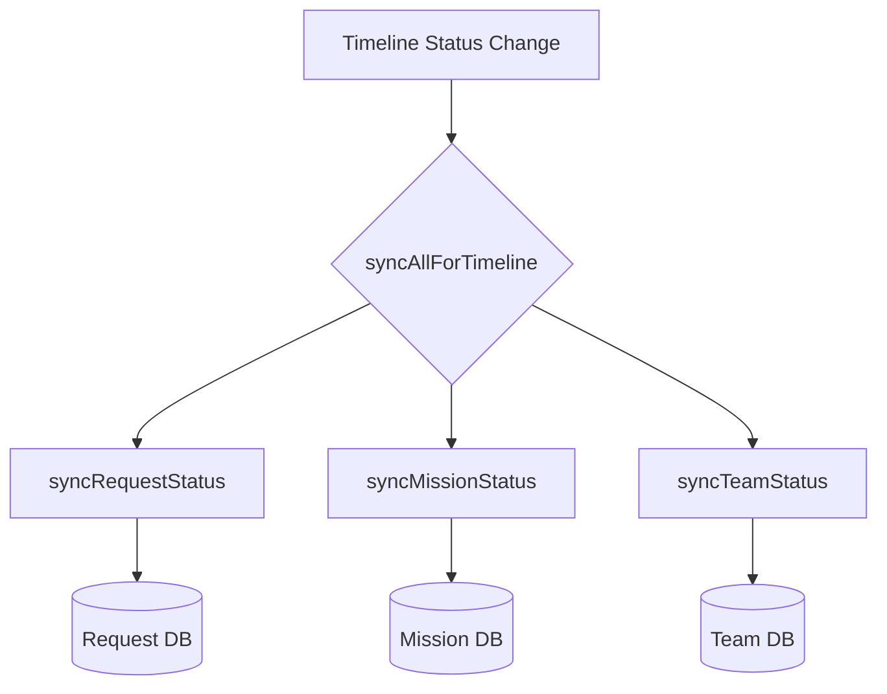
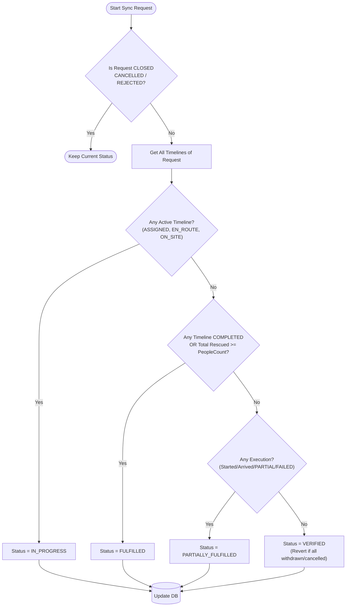
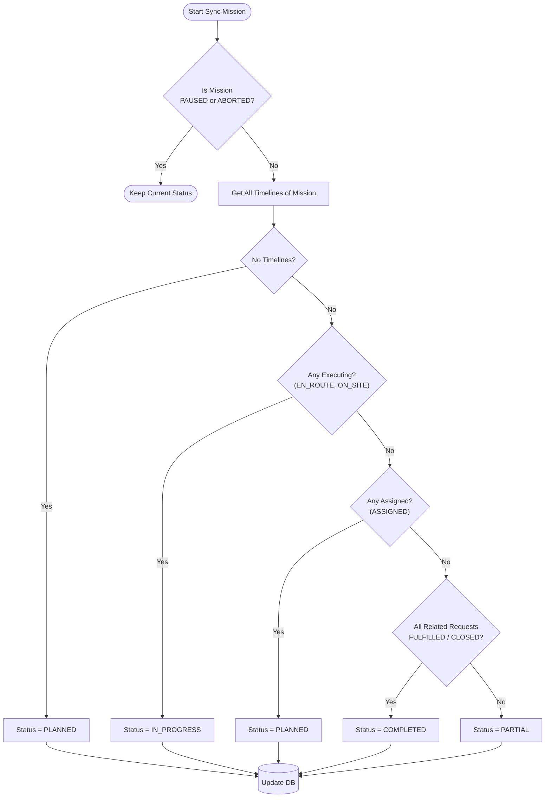
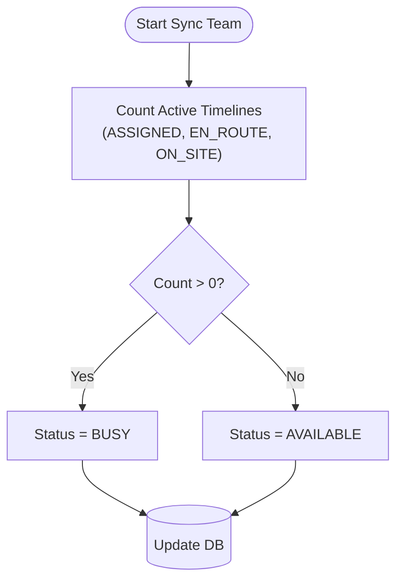

# Derivation Logic & Status Sync

> Tài liệu mô tả logic tự động cập nhật status (Derivation Logic) của các module `Request`, `Mission`, `Team` dựa trên trạng thái của `Timeline`.
>
> **Source of Truth:** `Timeline` status.

---

## 1. Tổng quan quy trình Sync

Mọi thay đổi trạng thái của `Timeline` (Assign, Accept, Arrive, Complete, Fail, Withdraw, Cancel) đều kích hoạt `syncAllForTimeline(timeline)`.

---

## 2. Request Status Derivation

**Logic:** Request status được tính toán dựa trên tập hợp tất cả Timelines thuộc Request đó.

**Chi tiết rules:**

1. **IN_PROGRESS**: Nếu có bất kỳ timeline nào đang hoạt động (`ASSIGNED`, `EN_ROUTE`, `ON_SITE`).
2. **FULFILLED**: Nếu không còn timeline hoạt động VÀ (có timeline `COMPLETED` HOẶC tổng số người cứu >= `peopleCount`).
3. **PARTIALLY_FULFILLED**: Nếu không thỏa mãn trên nhưng đã từng có timeline chạy (có `startedAt`, `arrivedAt` hoặc status `PARTIAL`, `FAILED`, `COMPLETED`).
4. **VERIFIED**: Nếu chưa có timeline nào chạy (ví dụ: tất cả đều `WITHDRAWN` hoặc `CANCELLED` ngay từ đầu). Status quay về `VERIFIED` để chờ assign lại.

---

## 3. Mission Status Derivation

**Logic:** Mission status phản ánh trạng thái tổng hợp của các timelines và requests bên trong nó.

**Chi tiết rules:**

1. **PAUSED / ABORTED**: Giữ nguyên (là manual states).
2. **IN_PROGRESS**: Nếu có timeline đang thực thi (`EN_ROUTE`, `ON_SITE`).
3. **PLANNED**:
   - Nếu chưa có timeline nào.
   - HOẶC chỉ có timeline `ASSIGNED` (chưa team nào accept).
4. **COMPLETED**: Nếu không còn timeline active VÀ tất cả Requests liên quan đều `FULFILLED` hoặc `CLOSED`.
5. **PARTIAL**: Nếu không còn timeline active NHƯNG vẫn còn Request chưa xong (cần tạo timeline mới).

---

## 4. Team Status Derivation

**Logic:** Team status đơn giản dựa trên việc có timeline active nào không.

**Chi tiết rules:**

1. **BUSY**: Đang có ít nhất 1 timeline `ASSIGNED`, `EN_ROUTE`, hoặc `ON_SITE`.
2. **AVAILABLE**: Không có timeline nào ở trạng thái active.
