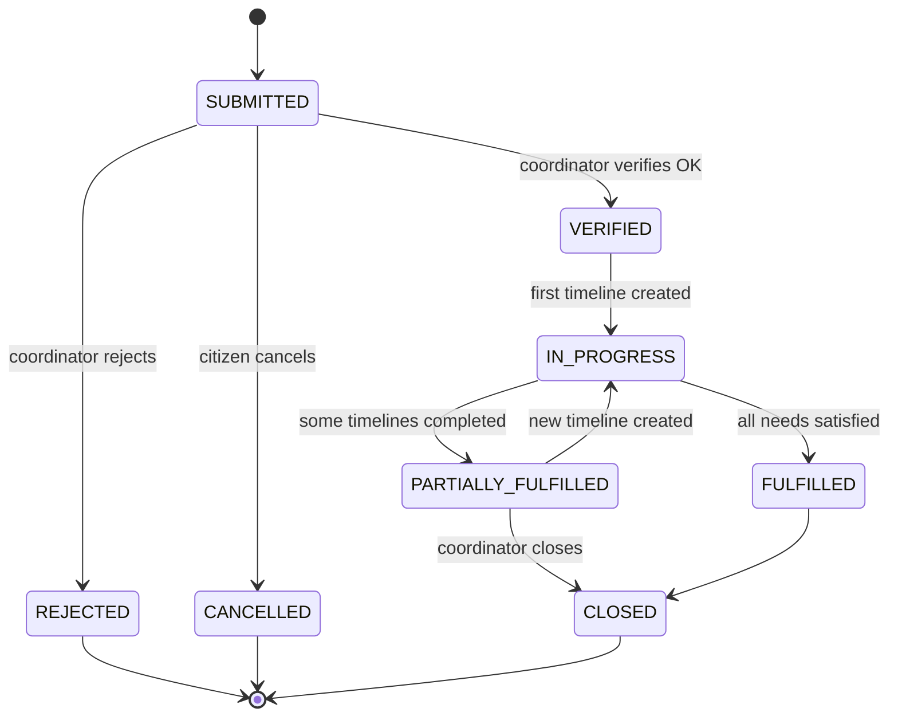
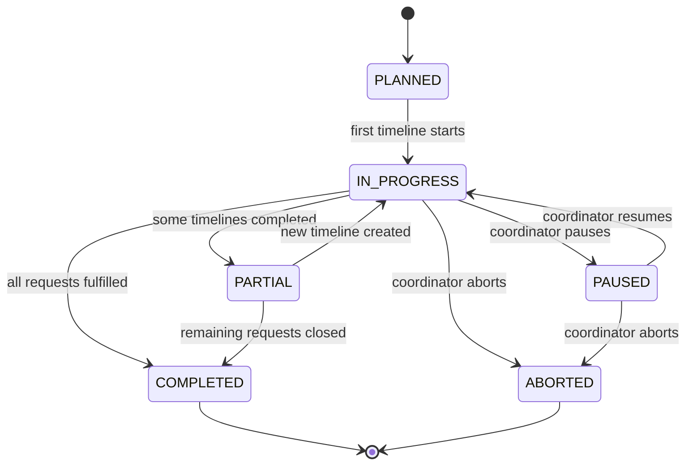
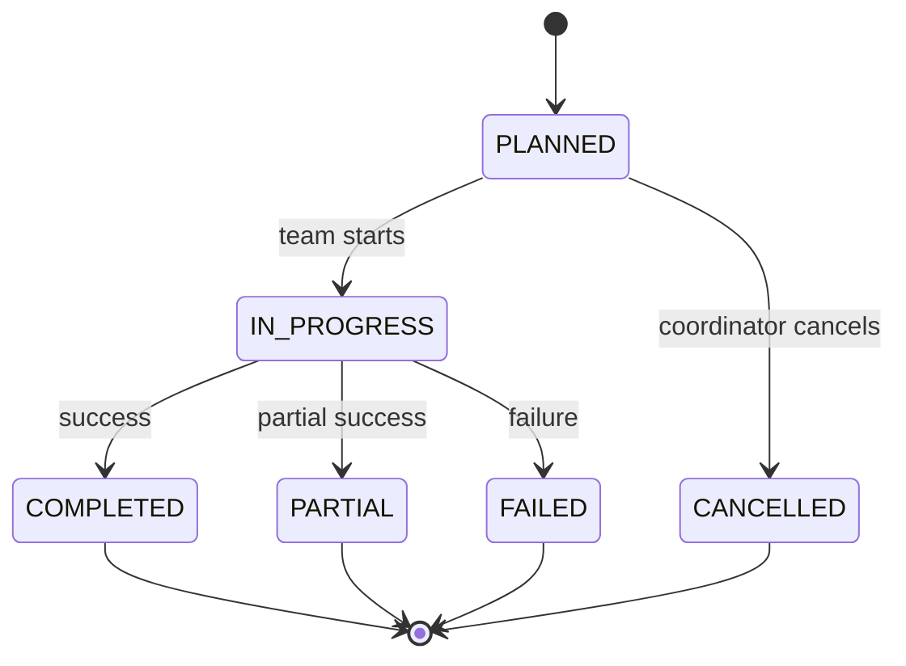

# Relief Flow 1.0 (Unified Model)

Cập nhật flow cứu trợ và cứu hộ (Relief & Rescue) theo mô hình unified mới.

---

## 1. Request State Diagram (Unified)

### 1.1 Request States Definitions

| State                 | Ý nghĩa                  |
| :-------------------- | :----------------------- |
| `SUBMITTED`           | Yêu cầu được gửi         |
| `VERIFIED`            | Được xác minh            |
| `REJECTED`            | Không hợp lệ             |
| `IN_PROGRESS`         | Có ≥1 timeline đang chạy |
| `PARTIALLY_FULFILLED` | Đã xử lý 1 phần          |
| `FULFILLED`           | Đã xử lý đủ              |
| `CLOSED`              | Đóng request             |
| `CANCELLED`           | Bị huỷ                   |

### 1.2 Request State Diagram

> **Rule:**
>
> - Rescue hay Relief đều giống nhau (về flow request).
> - `FULFILLED` dựa trên tổng kết quả các timeline.

---

## 2. Mission State Diagram (Unified)

### 2.1 Mission States Definitions

| State         | Ý nghĩa               |
| :------------ | :-------------------- |
| `PLANNED`     | Đã tạo mission        |
| `IN_PROGRESS` | Có timeline đang chạy |
| `PAUSED`      | Tạm dừng              |
| `PARTIAL`     | Hoàn thành 1 phần     |
| `COMPLETED`   | Hoàn tất              |
| `ABORTED`     | Huỷ                   |

### 2.2 Mission State Diagram

> **Rule:**
>
> - Mission không quan tâm là rescue hay relief.
> - Mission quan tâm còn timeline active hay không.

---

## 3. Timeline State Diagram (Unified Core)

### 3.1 Timeline States Definitions

| State         | Ý nghĩa           |
| :------------ | :---------------- |
| `PLANNED`     | Đã tạo, chờ chạy  |
| `IN_PROGRESS` | Team đang xử lý   |
| `COMPLETED`   | Hoàn thành        |
| `PARTIAL`     | Hoàn thành 1 phần |
| `FAILED`      | Không thể xử lý   |
| `CANCELLED`   | Bị huỷ            |

### 3.2 Timeline State Diagram

---

## 4. Cách vận hành Rescue đa timeline (Ví dụ thực tế)

**Ví dụ:** Một toà nhà ngập, 10 người mắc kẹt.

1.  **Team A** → Tầng 1 (Timeline #1)
2.  **Team B** → Tầng 2 (Timeline #2)
3.  **Team C** → Tầng 3 (Timeline #3)

👉 **1 Rescue Mission – 3 Timeline – 3 Team – 1 Request**

---

## 5. So sánh với Rescue_flow_2.1 cũ

| Rescue 2.1 (Cũ)      | Mô hình mới (Unified)   |
| :------------------- | :---------------------- |
| 1 team / 1 request   | Multi-team              |
| 1 timeline           | N timeline              |
| Reassign = thay team | Reassign = timeline mới |
| Khó scale            | Scale tốt               |

👉 **Mô hình mới bao trùm hoàn toàn mô hình cũ.**
