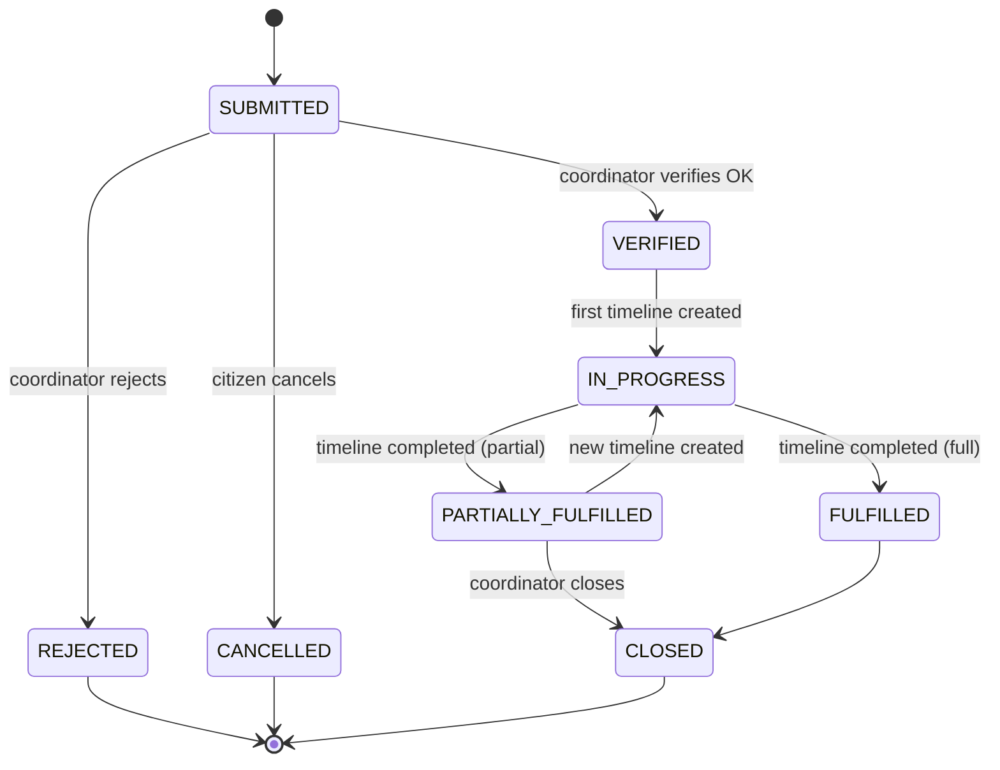
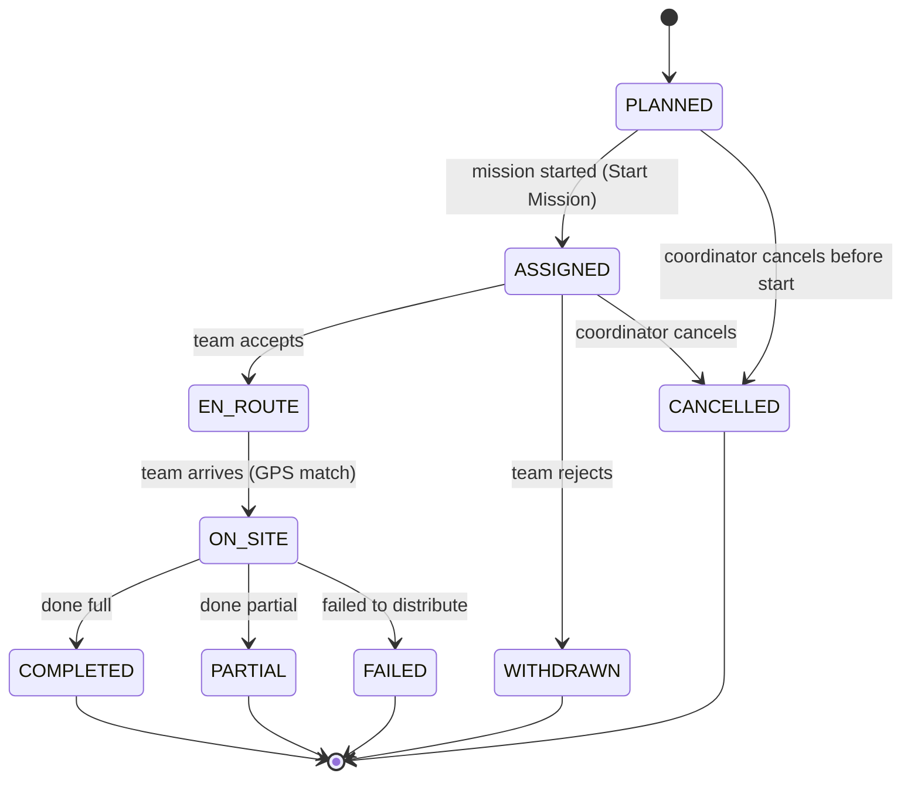
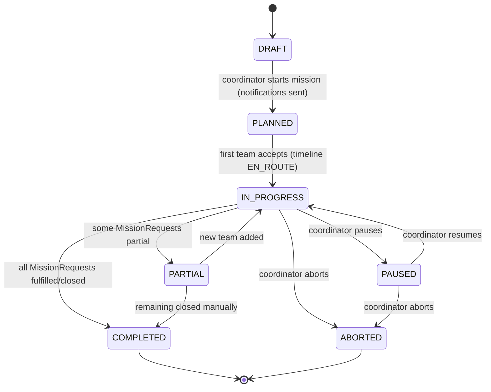
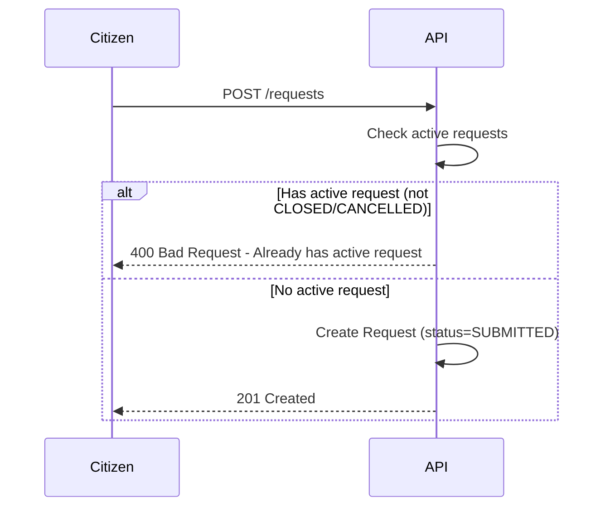
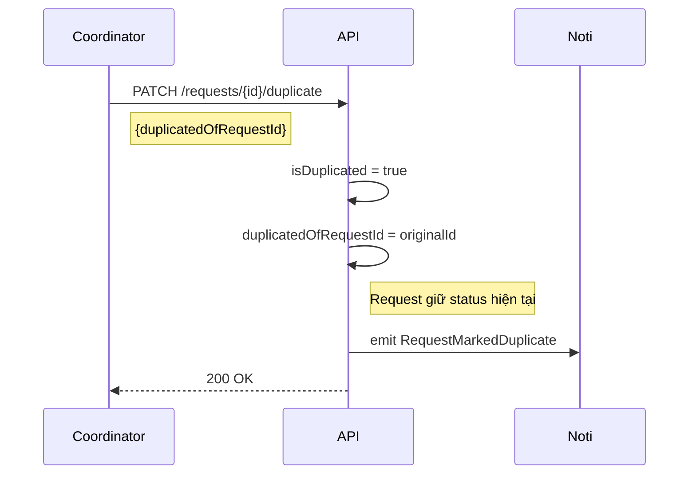
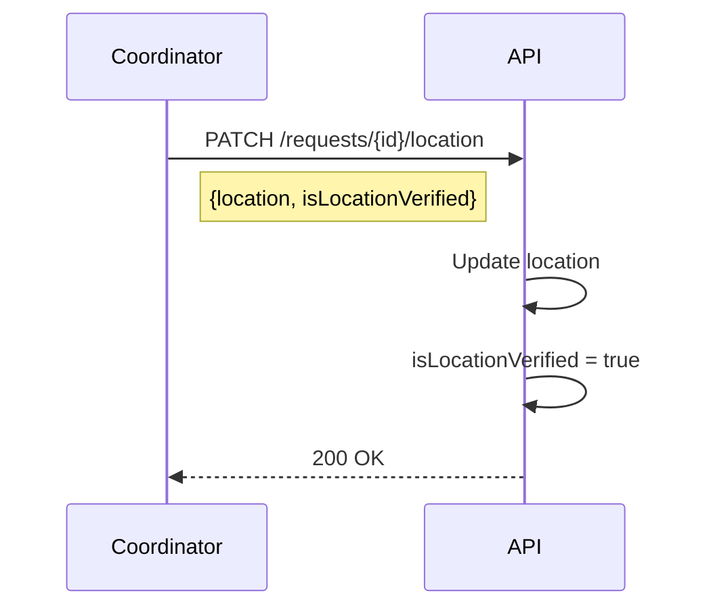

# Relief Flow 1.1 (Redesigned — Multi-Request Mission)

> Phiên bản redesign đồng bộ với [Rescue_flow_2.2.md](./Rescue_flow_2.2.md).
>
> **Changes v1.1 (redesign)**:
>
> - Mission khởi đầu ở `DRAFT`; Coordinator lên kế hoạch trước khi Start.
> - Coordinator kéo Request vào mission → tạo `MissionRequest` (status=`PENDING`).
> - Coordinator ghép Team vào mission → tạo `Timeline` (status=`PLANNED`).
> - **Start Mission** → tất cả `PLANNED` Timeline → `ASSIGNED`; notify teams.
> - `Timeline` không còn `requestId` FK. `MissionRequest` theo dõi supply fulfillment cho từng request.
> - **V2 TeamRequest-first (Option A):** Start Mission pre-create `TeamRequest` cho mọi cặp (`MissionRequest` x Team assigned).
> - Team cập nhật phân phối qua `POST /api/missionRequests/:id/progress`; backend ghi contribution theo team và sync aggregate về MissionRequest.

---

## 1. Request State Diagram (Unified)

### 1.1 Request States Definitions

| State                 | Ý nghĩa                     |
| :-------------------- | :-------------------------- |
| `SUBMITTED`           | Yêu cầu được gửi            |
| `VERIFIED`            | Đã xác minh (Verified OK)   |
| `REJECTED`            | Không hợp lệ                |
| `IN_PROGRESS`         | Có ≥1 timeline đang chạy    |
| `PARTIALLY_FULFILLED` | Đã phát 1 phần / Cứu 1 phần |
| `FULFILLED`           | Đã phát đủ / Cứu đủ         |
| `CLOSED`              | Đóng request (Final)        |
| `CANCELLED`           | Bị huỷ                      |

### 1.2 Request State Diagram

---

## 2. Timeline State Diagram (Unified Core + Tracking)

### 2.1 Timeline States Definitions

| State       | Ý nghĩa                                                                    |
| :---------- | :------------------------------------------------------------------------- |
| `PLANNED`   | Team đã được ghép vào mission; mission chưa start; team chưa được thông báo |
| `ASSIGNED`  | Mission đã start; team được thông báo; chờ accept                          |
| `EN_ROUTE`  | Team đang đi (GPS Tracking)                                                |
| `ON_SITE`   | Team đã đến điểm cứu trợ và đang phát đồ                                   |
| `COMPLETED` | Phát xong (Đủ hàng)                                                        |
| `PARTIAL`   | Phát xong (Thiếu hàng)                                                     |
| `FAILED`    | Không thể tiếp cận / Hỏng xe                                               |
| `WITHDRAWN` | Team từ chối nhiệm vụ                                                      |
| `CANCELLED` | Bị huỷ                                                                     |

### 2.2 Timeline State Diagram

---

## 3. Mission State Diagram (Unified)

### 3.1 Mission States Definitions

| State         | Ý nghĩa                                                                    |
| :------------ | :------------------------------------------------------------------------- |
| `DRAFT`       | Coordinator đang lên kế hoạch — thêm requests, ghép teams                  |
| `PLANNED`     | Start Mission đã bấm; notifications gửi; chờ team accept                   |
| `IN_PROGRESS` | Có timeline đang chạy                                                      |
| `PAUSED`      | Tạm dừng                                                                   |
| `PARTIAL`     | Hoàn thành một phần (cần thêm timeline)                                    |
| `COMPLETED`   | Hoàn tất toàn bộ MissionRequests                                           |
| `ABORTED`     | Huỷ mission                                                                |

### 3.2 Mission State Diagram

---

## 4. Derived Rules Summary

- **MissionRequest = FULFILLED** khi `suppliesDelivered >= requestSuppliesSnapshot` (all items) và `rescuedCount >= requestPeopleSnapshot`.
- **Request = FULFILLED** khi MissionRequest tương ứng đạt trạng thái `FULFILLED`.
- **Request = PARTIALLY_FULFILLED** khi các MissionRequest đã kết thúc nhưng aggregate còn thiếu so với target.
- **Tracking**: Relief Team cũng gửi tọa độ GPS liên tục khi `EN_ROUTE` để Citizen theo dõi.
- **Aggregate source**: MissionRequest aggregate được tính từ tổng contribution của các TeamRequest cùng `missionRequestId`.

### Supply Tracking Rules

Relief Flow sử dụng Supply Management giống Rescue Flow:

| Phase            | Timing                                              | Action                                                                         |
| ---------------- | --------------------------------------------------- | ------------------------------------------------------------------------------ |
| **Planning**     | `POST /missions/{id}/teams` — Coordinator assigns team to mission | Reserve supplies từ Warehouse; snapshot vào `MissionRequest.requestSuppliesSnapshot` |
| **Start**        | `PATCH /missions/{id}/start`                         | Pre-create TeamRequest matrix cho mọi MissionRequest x Team assigned |
| **Carrying**     | Team accepts (Timeline → EN_ROUTE)                  | Deduct inventory, confirm `carriedQty` on Timeline                             |
| **Distribution** | Team gửi progress (`POST /missionRequests/{id}/progress`) | Ghi TeamRequest contribution; recompute aggregate `MissionRequest.suppliesDelivered`; return unused |

> Chi tiết xem [Supply_management.md](../Supply_management.md)

---

## 5. Request Priority Rules

Khi Coordinator có nhiều Requests cần xử lý cùng lúc, ưu tiên theo thứ tự:

1. **Mức độ khẩn cấp (priority)** - _Coordinator gắn flag thủ công khi verify_
   - `CRITICAL` (High): Nguy hiểm tính mạng ngay lập tức
   - `HIGH` (Medium): Nguy cơ cao, chưa khẩn cấp tức thì
   - `NORMAL` (Low): Hỗ trợ khi có điều kiện

2. **Số người bị ảnh hưởng (peopleCount)**
   - Ưu tiên request có nhiều người hơn

3. **Thời gian tạo yêu cầu (createdAt)**
   - First-come-first-served nếu priority và peopleCount bằng nhau

---

## 6. Validation & Duplicate Detection

### Request Creation Validation

**Rule:** Một Citizen chỉ được tạo Request mới khi request hiện tại đã ở terminal states (`CLOSED` hoặc `CANCELLED`).

### Duplicate Detection

Coordinator đánh dấu duplicate thủ công. _Future: Hệ thống đề xuất duplicate dựa trên location + time + citizen._

> **Note:** Request được đánh dấu duplicate vẫn được xử lý bình thường và có thể chuyển qua các status như request thông thường, nhưng sẽ được link với request gốc để tracking.

### Location Verification

Coordinator có thể cập nhật location và đánh dấu verified.

---

## 7. API Endpoints Summary

### Request Management

| Method  | Endpoint                   | Actor               | Description                                       |
| :------ | :------------------------- | :------------------ | :------------------------------------------------ |
| `POST`  | `/requests`                | Citizen/Coordinator | Create request (validates 1 active request limit) |
| `PATCH` | `/requests/{id}/verify`    | Coordinator         | Verify request → `VERIFIED` / `REJECTED`          |
| `PATCH` | `/requests/{id}/duplicate` | Coordinator         | Mark as duplicate                                 |
| `PATCH` | `/requests/{id}/location`  | Coordinator         | Update location & verify                          |

### Mission Planning (new model)

| Method   | Endpoint                      | Actor       | Description                                             |
| :------- | :---------------------------- | :---------- | :------------------------------------------------------ |
| `POST`   | `/missions`                   | Coordinator | Create mission in `DRAFT` state                         |
| `POST`   | `/missions/{id}/requests`     | Coordinator | Add request to mission → creates `MissionRequest(PENDING)` |
| `POST`   | `/missions/{id}/teams`        | Coordinator | Assign team → creates `Timeline(PLANNED)`               |
| `PATCH`  | `/missions/{id}/start`        | Coordinator | Start mission → all Timelines `PLANNED→ASSIGNED`, notify teams |
| `GET`    | `/missions/{id}/requests`     | Coordinator/Team | List MissionRequests + per-team contribution summary |
| `POST`   | `/missionRequests/{id}/progress` | Team | Update per-team distributed/rescued contribution |

### Team Execution

| Method   | Endpoint                         | Actor | Description                                        |
| :------- | :------------------------------- | :---- | :------------------------------------------------- |
| `PATCH`  | `/timelines/{id}/accept`         | Team  | Accept assignment → `ASSIGNED → EN_ROUTE`; Mission `→ IN_PROGRESS` |
| `PATCH`  | `/timelines/{id}/arrive`         | Team  | Arrive on site → `EN_ROUTE → ON_SITE`              |
| `PATCH`  | `/timelines/{id}/complete`       | Team  | Report completion `{rescuedCount, suppliesDelivered}` → `ON_SITE → COMPLETED` / `PARTIAL` |
| `PATCH`  | `/timelines/{id}/withdraw`       | Team  | Withdraw from mission → `WITHDRAWN`                |

---

## 8. References

- [rules.md](./rules.md) - Rules chính thức.
- [Rescue_flow_2.2.md](./Rescue_flow_2.2.md) - Flow cứu hộ tương ứng.
- [Supply_management.md](../Supply_management.md) - Supply tracking 3-phase.

---

## Phase 1 Implementation Notes (2026-02-15)

- Core Timeline lifecycle APIs đã được implement theo Unified v2.2.
- Request/Mission/Team status được derive/sync từ Timeline runtime status.
- Trong Phase 1 chưa tích hợp GPS Position và TimelineSupply cho Relief execution.

## V2 Implementation Notes (Option A - TeamRequest)

- Mission start tạo TeamRequest matrix trước khi team nhận task, giúp team thấy requests ngay sau assign.
- Team update progress đi theo write-path TeamRequest trước, rồi sync MissionRequest aggregate để phục vụ dashboard nhanh.
- TeamRequest chỉ lưu contribution/audit, không có `status`; trạng thái vận hành dùng Timeline làm source of truth.
- Trạng thái Request cuối mission hỗ trợ rõ `PARTIALLY_FULFILLED` khi chưa đạt đủ target nhưng đã kết thúc xử lý.
