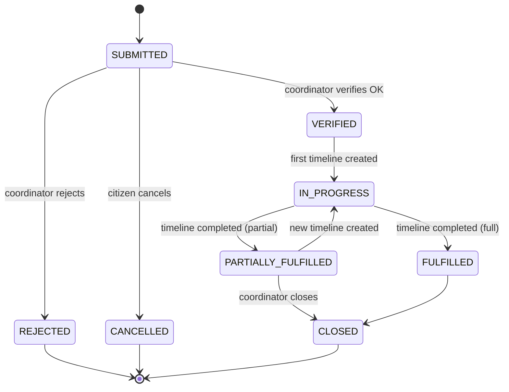
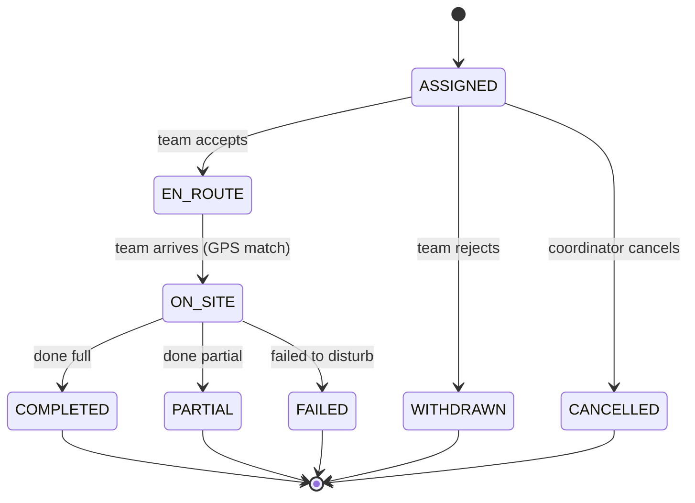
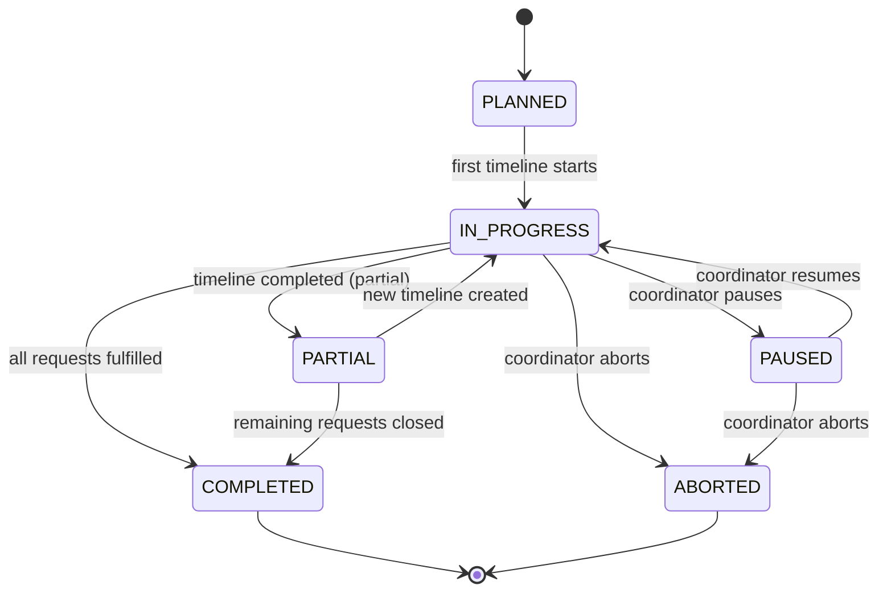

# Relief Flow 1.1 (Unified)

> Phiên bản Unified từ [Relief_flow_1.0.md](./Relief_flow_1.0.md)
>
> **Changes v1.1**:
>
> - Đồng bộ với [rules.md](./rules.md).
> - Thêm **GPS Tracking** (`EN_ROUTE`, `ON_SITE`) giống Rescue Flow.
> - Timeline khởi tạo là `ASSIGNED`.

---

## 1. Request State Diagram (Unified)

### 1.1 Request States Definitions

| State                 | Ý nghĩa                     |
| :-------------------- | :-------------------------- |
| `SUBMITTED`           | Yêu cầu được gửi            |
| `VERIFIED`            | Đã xác minh (Verified OK)   |
| `REJECTED`            | Không hợp lệ                |
| `IN_PROGRESS`         | Có ≥1 timeline đang chạy    |
| `PARTIALLY_FULFILLED` | Đã phát 1 phần / Cứu 1 phần |
| `FULFILLED`           | Đã phát đủ / Cứu đủ         |
| `CLOSED`              | Đóng request (Final)        |
| `CANCELLED`           | Bị huỷ                      |

### 1.2 Request State Diagram

---

## 2. Timeline State Diagram (Unified Core + Tracking)

### 2.1 Timeline States Definitions

| State       | Ý nghĩa                                  |
| :---------- | :--------------------------------------- |
| `ASSIGNED`  | Đã gán team (chờ accept)                 |
| `EN_ROUTE`  | Team đang đi (GPS Tracking)              |
| `ON_SITE`   | Team đã đến điểm cứu trợ và đang phát đồ |
| `COMPLETED` | Phát xong (Đủ hàng)                      |
| `PARTIAL`   | Phát xong (Thiếu hàng)                   |
| `FAILED`    | Không thể tiếp cận / Hỏng xe             |
| `WITHDRAWN` | Team từ chối nhiệm vụ                    |
| `CANCELLED` | Bị huỷ                                   |

### 2.2 Timeline State Diagram

---

## 3. Mission State Diagram (Unified)

### 3.1 Mission States Definitions

| State         | Ý nghĩa                                 |
| :------------ | :-------------------------------------- |
| `PLANNED`     | Đã tạo mission                          |
| `IN_PROGRESS` | Có timeline đang chạy                   |
| `PAUSED`      | Tạm dừng                                |
| `PARTIAL`     | Hoàn thành một phần (cần thêm timeline) |
| `COMPLETED`   | Hoàn tất toàn bộ requests               |
| `ABORTED`     | Huỷ mission                             |

### 3.2 Mission State Diagram

---

## 4. Derived Rules Summary

- **Request = FULFILLED** khi `Sum(Timeline.supplied_amount) >= Request.need_amount`.
- **Request = PARTIALLY_FULFILLED** khi `Sum(...) < Request.need_amount` và hết timeline chạy.
- **Tracking**: Relief Team cũng gửi tọa độ GPS liên tục khi `EN_ROUTE` để Citizen theo dõi.

---

## 5. References

- [rules.md](./rules.md) - Rules chính thức.
- [Rescue_flow_2.2.md](./Rescue_flow_2.2.md) - Flow cứu hộ tương ứng.
