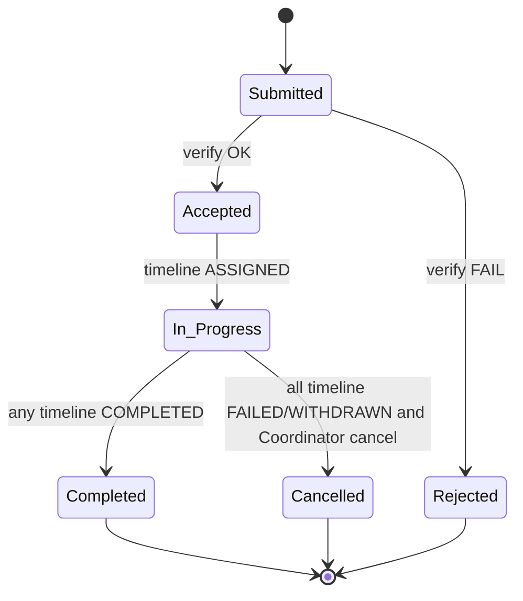

## Sequence Diagram của luồng rescue

```mermaid
sequenceDiagram
    autonumber

    participant CitizenApp as Citizen App
    participant CoordinatorUI as Coordinator Dashboard
    participant TeamApp as Rescue Team App
    participant API as API Server
    participant Noti as Notification Service

    %% --- Submit Rescue Request ---
    CitizenApp ->> API: POST /api/requests
    API ->> API: Validate & create request
    API ->> API: status = SUBMITTED
    API ->> Noti: emit RequestSubmitted
    Noti ->> CitizenApp: Push/SMS confirmation

    %% --- Coordinator verifies request ---
    CoordinatorUI ->> API: GET /api/requests?status=SUBMITTED
    CoordinatorUI ->> API: PATCH /api/requests/{id}/verify

    alt Invalid request
        API ->> API: status = REJECTED
        API ->> Noti: emit RequestRejected
        Noti ->> CitizenApp: Rejection notification
    else Valid request
        CoordinatorUI ->> API: PATCH /api/requests/{id}/priority
        CoordinatorUI ->> API: POST /api/missions
        API ->> API: status = ASSIGNED
        API ->> Noti: emit MissionAssigned
        Noti ->> CitizenApp: Team assigned
        Noti ->> TeamApp: New mission
    end

    %% --- Rescue team execution ---
    TeamApp ->> API: GET /api/missions?assigned=true
    TeamApp ->> API: PATCH /api/missions/{id}/accept
    API ->> API: status = ACCEPTED

    TeamApp ->> API: PATCH /api/missions/{id}/status (APPROACHING)
    API ->> CoordinatorUI: Push real-time update

    %% --- Mission outcome ---
    alt Rescue success
        TeamApp ->> API: PATCH /api/missions/{id}/status (RESCUED)
        TeamApp ->> API: POST /api/missions/{id}/report
        CitizenApp ->> API: POST /api/requests/{id}/confirm-safe
        API ->> API: status = COMPLETED
        API ->> Noti: emit MissionCompleted
    else Rescue failed
        TeamApp ->> API: PATCH /api/missions/{id}/status (FAILED)
        TeamApp ->> API: POST /api/missions/{id}/report
        API ->> Noti: emit MissionFailed

        CoordinatorUI ->> API: POST /api/missions/{id}/reassign
        API ->> Noti: emit MissionReassigned
        Noti ->> TeamApp: New assignment
    end
```

## State Diagram của request

🔑 Rule quan trọng

- Trong thời gian chờ reassign sau khi timeline `Failed`, Request vẫn ở trạng thái `In_Progress`
- `Accepted` → `In_Progress` chỉ xảy ra khi có mission_timeline
- `Completed` chỉ cần 1 timeline thành công
- `Cancelled` khi mọi attempt đều thất bại và Coordinator cancel

| Trạng thái           | Ai set               | Ý nghĩa                                                            | Cho phép                                                              | Không cho phép / Ghi chú                                                     |
| -------------------- | -------------------- | ------------------------------------------------------------------ | --------------------------------------------------------------------- | ---------------------------------------------------------------------------- |
| 🟦 **`Submitted`**   | Citizen / System     | - Yêu cầu đã được gửi - Chưa qua xác minh                       | - Coordinator xem - Verify / Reject                                | - Assign team - Tạo mission                                               |
| 🟨 **`Accepted`**    | Coordinator          | Request hợp lệ, được chấp nhận về mặt nghiệp vụ ⚠️ Chưa có team | - Set priority - Assign rescue team                                | - Rescue team thao tác 👉 Business approval, **chưa phải execution**      |
| 🟥 **`Rejected`**    | Coordinator          | Request không hợp lệ / spam / sai thông tin                        | —                                                                     | - Trạng thái kết thúc (terminal) - Không thể reopen                       |
| 🟦 **`In Progress`** | System               | Đã có ít nhất 1 mission active xử lý request                       | - Theo dõi real-time - Reassign mission - Update mission status | Trigger khi mission được tạo & assign                                        |
| 🟩 **`Completed`**   | System               | Request đã được xử lý thành công                                   | —                                                                     | - Mission = `SUCCESS` - Citizen confirm safe (nếu có) - Terminal state |
| ⚫ **`Cancelled`**   | System / Coordinator | Request không thể hoàn thành dù đã bắt đầu xử lý                   | —                                                                     | - Mission `FAILED` và không reassign  - Coordinator cancel                |

#### Note:

> `Cancelled` khác `Rejected` ở chỗ:
>
> - `Rejected` → chưa từng xử lý
> - `Cancelled` → đã xử lý nhưng thất bại

### Validation rules:

- `Submitted` chỉ có thể chuyển sang `Accepted` hoặc `Rejected`
- `Accepted` bắt buộc phải chuyển sang `In Progress` thông qua assign mission
- `In Progress` chỉ kết thúc bằng `Completed` hoặc `Cancelled`
- Không được phép update ngược trạng thái
