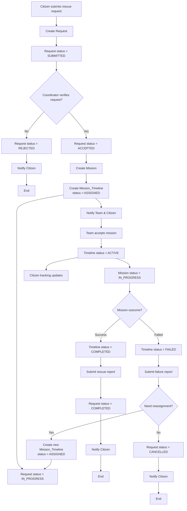
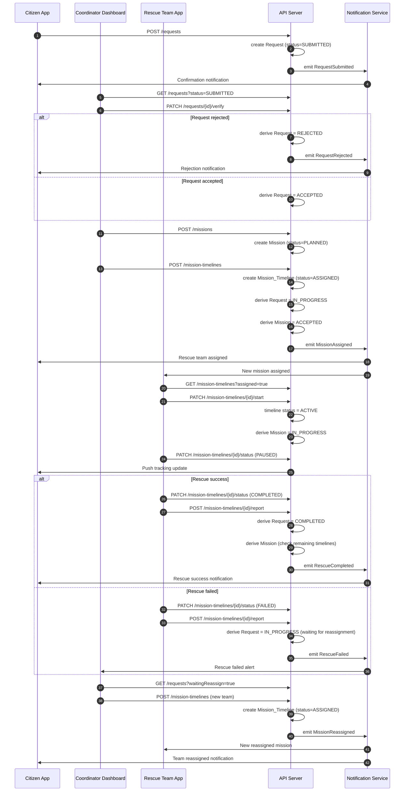

## Flowchart for rescue flow

```mermaid
flowchart TD
    A[Citizen submits rescue request] --> B[Create Request]
    B --> C[Request status = SUBMITTED]

    C --> D{Coordinator verifies request?}

    D -- No --> E[Request status = REJECTED]
    E --> F[Notify Citizen]
    F --> END1[End]

    D -- Yes --> G[Request status = ACCEPTED]

    G --> H[Create Mission]
    H --> I[Create Mission_Timeline<br/>status = ASSIGNED]
    I --> J[Request status = IN_PROGRESS]
    I --> K[Notify Team & Citizen]

    K --> L[Team accepts mission]
    L --> M[Timeline status = ACTIVE]
    M --> N[Mission status = IN_PROGRESS]

    M --> O[Citizen tracking updates]

    N --> P{Mission outcome?}

    P -- Success --> Q[Timeline status = COMPLETED]
    Q --> R[Submit rescue report]
    R --> S[Request status = COMPLETED]
    S --> T[Notify Citizen]
    T --> END2[End]

    P -- Failed --> U[Timeline status = FAILED]
    U --> V[Submit failure report]
    V --> W{Need reassignment?}

    W -- No --> X[Request status = CANCELLED]
    X --> Y[Notify Citizen]
    Y --> END3[End]

    W -- Yes --> Z[Create new Mission_Timeline<br/>status = ASSIGNED]
    Z --> J
```

## Sequence diagram for rescue flow

```mermaid
sequenceDiagram
    autonumber

    participant Citizen as Citizen App
    participant Coordinator as Coordinator Dashboard
    participant Team as Rescue Team App
    participant API as API Server
    participant Noti as Notification Service

    %% -----------------------------
    %% Submit rescue request
    %% -----------------------------
    Citizen ->> API: POST /requests
    API ->> API: create Request (status=SUBMITTED)
    API ->> Noti: emit RequestSubmitted
    Noti ->> Citizen: Confirmation notification

    %% -----------------------------
    %% Verify request
    %% -----------------------------
    Coordinator ->> API: GET /requests?status=SUBMITTED
    Coordinator ->> API: PATCH /requests/{id}/verify

    alt Request rejected
        API ->> API: derive Request = REJECTED
        API ->> Noti: emit RequestRejected
        Noti ->> Citizen: Rejection notification
    else Request accepted
        API ->> API: derive Request = ACCEPTED
    end

    %% -----------------------------
    %% Assign mission & create timeline
    %% -----------------------------
    Coordinator ->> API: POST /missions
    API ->> API: create Mission (status=PLANNED)

    Coordinator ->> API: POST /mission-timelines
    API ->> API: create Mission_Timeline (status=ASSIGNED)
    API ->> API: derive Request = IN_PROGRESS
    API ->> API: derive Mission = ACCEPTED

    API ->> Noti: emit MissionAssigned
    Noti ->> Citizen: Rescue team assigned
    Noti ->> Team: New mission assigned

    %% -----------------------------
    %% Team execution
    %% -----------------------------
    Team ->> API: GET /mission-timelines?assigned=true
    Team ->> API: PATCH /mission-timelines/{id}/start
    API ->> API: timeline status = ACTIVE
    API ->> API: derive Mission = IN_PROGRESS

    Team ->> API: PATCH /mission-timelines/{id}/status (PAUSED)
    API ->> Citizen: Push tracking update

    %% -----------------------------
    %% Mission outcome
    %% -----------------------------
    alt Rescue success
        Team ->> API: PATCH /mission-timelines/{id}/status (COMPLETED)
        Team ->> API: POST /mission-timelines/{id}/report
        API ->> API: derive Request = COMPLETED
        API ->> API: derive Mission (check remaining timelines)
        API ->> Noti: emit RescueCompleted
        Noti ->> Citizen: Rescue success notification
    else Rescue failed
        Team ->> API: PATCH /mission-timelines/{id}/status (FAILED)
        Team ->> API: POST /mission-timelines/{id}/report
        API ->> API: derive Request = IN_PROGRESS (waiting for reassignment)
        API ->> Noti: emit RescueFailed
        Noti ->> Coordinator: Rescue failed alert
    end

    %% -----------------------------
    %% Reassignment flow
    %% -----------------------------
    Coordinator ->> API: GET /requests?waitingReassign=true
    Coordinator ->> API: POST /mission-timelines (new team)
    API ->> API: create Mission_Timeline (status=ASSIGNED)
    API ->> Noti: emit MissionReassigned
    Noti ->> Team: New reassigned mission
    Noti ->> Citizen: Team reassigned notification
```
