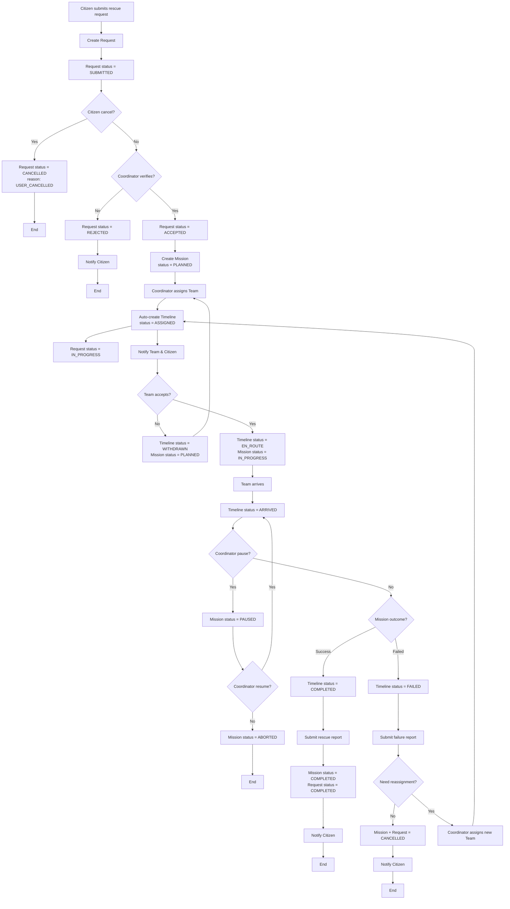
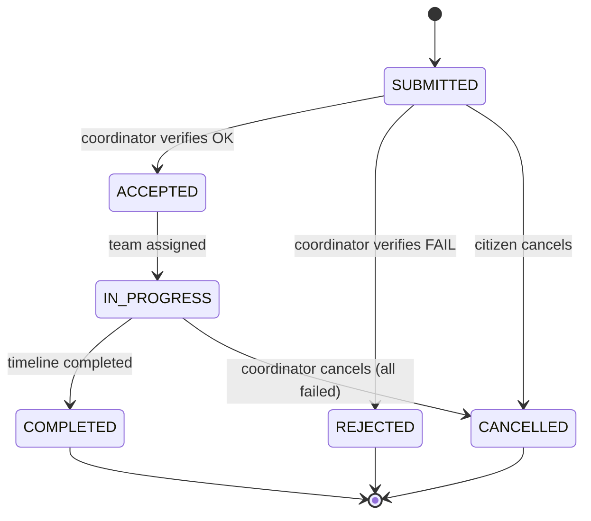
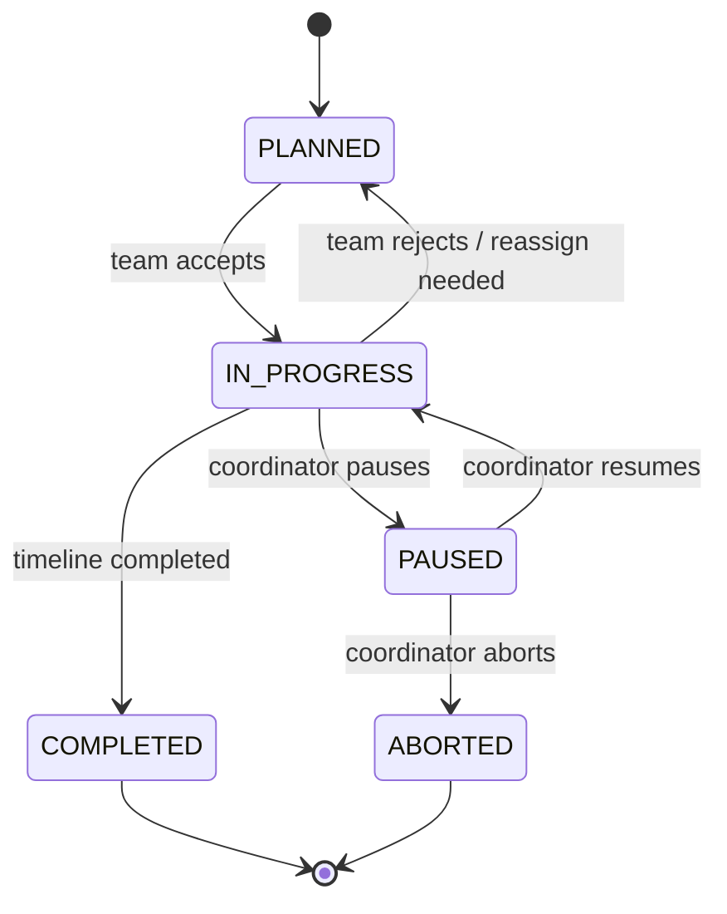
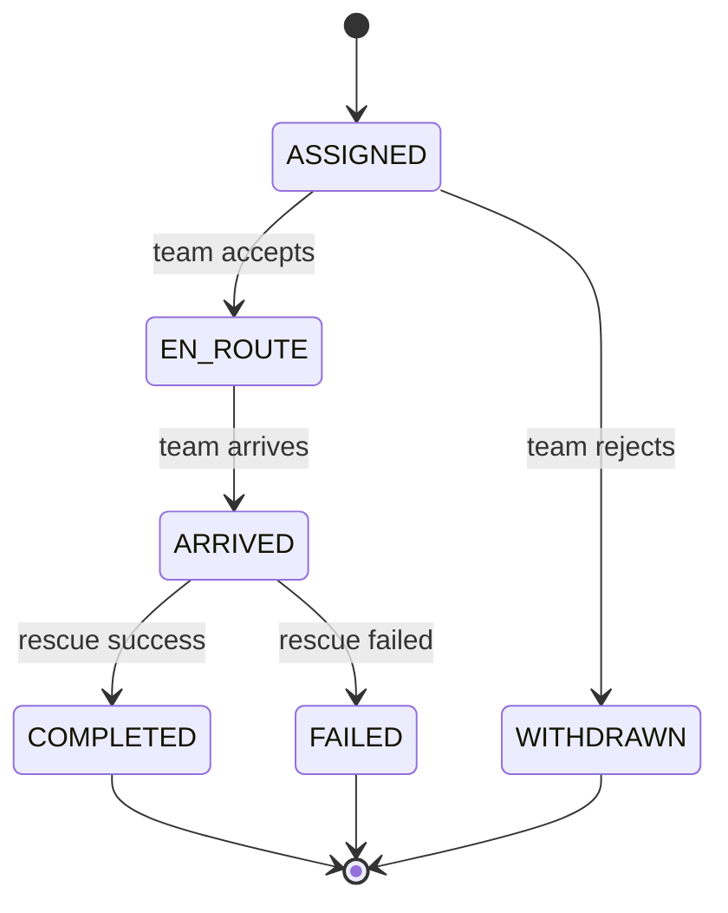

# Rescue Flow 2.1

> Phiên bản cải tiến từ [Rescue_flow_2.0.md](./Rescue_flow_2.0.md)
>
> **Changes v2.1**: Cancel chỉ SUBMITTED, auto-create timeline khi assign, PAUSED là Mission status, ACTIVE→ARRIVED

---

## Flowchart for Rescue Flow

---

## Sequence Diagram for Rescue Flow

```mermaid
sequenceDiagram
    autonumber

    participant Citizen as Citizen App
    participant Coordinator as Coordinator Dashboard
    participant Team as Rescue Team App
    participant API as API Server
    participant Noti as Notification Service

    %% -----------------------------
    %% Submit rescue request
    %% -----------------------------
    Citizen ->> API: POST /requests
    API ->> API: create Request (status=SUBMITTED)
    API ->> Noti: emit RequestSubmitted
    Noti ->> Citizen: Confirmation notification

    %% -----------------------------
    %% Citizen Cancel (SUBMITTED only)
    %% -----------------------------
    alt Citizen cancels (SUBMITTED only)
        Citizen ->> API: DELETE /requests/{id}
        API ->> API: validate status = SUBMITTED
        API ->> API: status = CANCELLED (reason: USER_CANCELLED)
        API ->> Noti: emit RequestCancelled
    end

    %% -----------------------------
    %% Verify request
    %% -----------------------------
    Coordinator ->> API: GET /requests?status=SUBMITTED
    Coordinator ->> API: PATCH /requests/{id}/verify

    alt Request rejected
        API ->> API: Request = REJECTED
        API ->> Noti: emit RequestRejected
        Noti ->> Citizen: Rejection notification
    else Request accepted
        API ->> API: Request = ACCEPTED
    end

    %% -----------------------------
    %% Create Mission (empty)
    %% -----------------------------
    Coordinator ->> API: POST /missions (requestId)
    API ->> API: create Mission (status=PLANNED)

    %% -----------------------------
    %% Assign Team → Auto-create Timeline
    %% -----------------------------
    Coordinator ->> API: PATCH /missions/{id}/assign (teamId)
    Note over API: Auto-create Timeline:<br/>status=ASSIGNED<br/>assignedAt=now()
    API ->> API: Request = IN_PROGRESS
    API ->> Noti: emit MissionAssigned
    Noti ->> Citizen: Rescue team assigned
    Noti ->> Team: New mission assigned

    %% -----------------------------
    %% Team Accept/Reject
    %% -----------------------------
    alt Team accepts
        Team ->> API: PATCH /timelines/{id}/accept
        API ->> API: Timeline = EN_ROUTE
        API ->> API: Mission = IN_PROGRESS
        API ->> Citizen: Push "Team is on the way"
    else Team rejects
        Team ->> API: PATCH /timelines/{id}/reject
        API ->> API: Timeline = WITHDRAWN
        API ->> API: Mission = PLANNED
        API ->> Noti: emit TeamRejected
        Noti ->> Coordinator: Team rejected alert
    end

    %% -----------------------------
    %% Team Execution
    %% -----------------------------
    Team ->> API: PATCH /timelines/{id}/arrive
    API ->> API: Timeline = ARRIVED
    API ->> Citizen: Push "Team has arrived"

    %% -----------------------------
    %% Coordinator Pause/Resume
    %% -----------------------------
    alt Coordinator pauses
        Coordinator ->> API: PATCH /missions/{id}/pause
        API ->> API: Mission = PAUSED
        API ->> Citizen: Push "Rescue paused: {reason}"
        API ->> Team: Push "Mission paused"

        Coordinator ->> API: PATCH /missions/{id}/resume
        API ->> API: Mission = IN_PROGRESS
        API ->> Citizen: Push "Rescue resumed"
        API ->> Team: Push "Mission resumed"
    end

    %% -----------------------------
    %% Mission Outcome
    %% -----------------------------
    alt Rescue success
        Team ->> API: PATCH /timelines/{id}/complete
        Team ->> API: POST /timelines/{id}/report
        API ->> API: Timeline = COMPLETED
        API ->> API: Mission = COMPLETED
        API ->> API: Request = COMPLETED
        API ->> Noti: emit RescueCompleted
        Noti ->> Citizen: Rescue success notification
    else Rescue failed
        Team ->> API: PATCH /timelines/{id}/fail
        Team ->> API: POST /timelines/{id}/report
        API ->> API: Timeline = FAILED
        API ->> Noti: emit RescueFailed
        Noti ->> Coordinator: Rescue failed alert
    end

    %% -----------------------------
    %% Reassignment (reuse /assign)
    %% -----------------------------
    Coordinator ->> API: PATCH /missions/{id}/assign (newTeamId)
    Note over API: Create new Timeline:<br/>status=ASSIGNED<br/>Previous timeline=FAILED/WITHDRAWN
    API ->> Noti: emit MissionReassigned
    Noti ->> Team: New reassigned mission
    Noti ->> Citizen: Team reassigned notification
```

---

## Status Definitions

### Request Status

| Status        | Description                      | Terminal? | Who Sets    |
| ------------- | -------------------------------- | --------- | ----------- |
| `SUBMITTED`   | Request mới được gửi, chờ verify | ❌        | System      |
| `ACCEPTED`    | Đã verify OK, chờ assign team    | ❌        | Coordinator |
| `REJECTED`    | Verify thất bại                  | ✅        | Coordinator |
| `IN_PROGRESS` | Đang có team xử lý               | ❌        | System      |
| `COMPLETED`   | Cứu hộ thành công                | ✅        | System      |
| `CANCELLED`   | Bị hủy bởi citizen hoặc abort    | ✅        | User/System |

### Mission Status

| Status        | Description                               | Terminal? |
| ------------- | ----------------------------------------- | --------- |
| `PLANNED`     | Mission tạo, chờ assign hoặc sau reject   | ❌        |
| `IN_PROGRESS` | Team đã accept, đang thực hiện            | ❌        |
| `PAUSED`      | Coordinator tạm dừng mission              | ❌        |
| `COMPLETED`   | Cứu hộ thành công                         | ✅        |
| `ABORTED`     | Coordinator abort hoặc không thể tiếp tục | ✅        |

### Timeline Status

| Status      | Description                    | Terminal? |
| ----------- | ------------------------------ | --------- |
| `ASSIGNED`  | Team được assign, chờ accept   | ❌        |
| `EN_ROUTE`  | Team đã accept, đang di chuyển | ❌        |
| `ARRIVED`   | Team đã đến, đang cứu hộ       | ❌        |
| `COMPLETED` | Cứu hộ thành công              | ✅        |
| `FAILED`    | Cứu hộ thất bại                | ✅        |
| `WITHDRAWN` | Team từ chối hoặc bị thay thế  | ✅        |

---

## State Machines

### Request State Machine

### Mission State Machine

### Timeline State Machine

---

## API Endpoints Summary

| Method   | Endpoint                   | Actor       | Description                            |
| -------- | -------------------------- | ----------- | -------------------------------------- |
| `POST`   | `/requests`                | Citizen     | Submit rescue request                  |
| `DELETE` | `/requests/{id}`           | Citizen     | Cancel request (SUBMITTED only)        |
| `PATCH`  | `/requests/{id}/verify`    | Coordinator | Accept/Reject request                  |
| `GET`    | `/requests`                | Coordinator | List requests                          |
| `POST`   | `/missions`                | Coordinator | Create empty mission                   |
| `PATCH`  | `/missions/{id}/assign`    | Coordinator | Assign/reassign team → create timeline |
| `PATCH`  | `/missions/{id}/pause`     | Coordinator | Pause mission                          |
| `PATCH`  | `/missions/{id}/resume`    | Coordinator | Resume mission                         |
| `PATCH`  | `/timelines/{id}/accept`   | Team        | Accept mission → EN_ROUTE              |
| `PATCH`  | `/timelines/{id}/reject`   | Team        | Reject → WITHDRAWN                     |
| `PATCH`  | `/timelines/{id}/arrive`   | Team        | Arrive at location → ARRIVED           |
| `PATCH`  | `/timelines/{id}/complete` | Team        | Mark as completed                      |
| `PATCH`  | `/timelines/{id}/fail`     | Team        | Mark as failed                         |
| `POST`   | `/timelines/{id}/report`   | Team        | Submit report                          |

---

## Tracking & Notifications

### Push Frequency

| Status     | Frequency             |
| ---------- | --------------------- |
| `EN_ROUTE` | Every 30 seconds      |
| `ARRIVED`  | On status change only |
| `PAUSED`   | On pause/resume       |

### Notification Events

| Event               | Recipient    | Message Template                          |
| ------------------- | ------------ | ----------------------------------------- |
| `MissionAssigned`   | Citizen      | "Đội cứu hộ {teamName} đã được phân công" |
| `TeamEnRoute`       | Citizen      | "Đội cứu hộ đang di chuyển, ETA: {eta}"   |
| `TeamArrived`       | Citizen      | "Đội cứu hộ đã đến"                       |
| `TeamRejected`      | Coordinator  | "Team {teamName} từ chối mission"         |
| `MissionPaused`     | Citizen/Team | "Mission tạm dừng: {reason}"              |
| `MissionResumed`    | Citizen/Team | "Mission tiếp tục"                        |
| `RescueCompleted`   | Citizen      | "Cứu hộ thành công!"                      |
| `RescueFailed`      | Coordinator  | "Cứu hộ thất bại, cần reassign"           |
| `MissionReassigned` | Citizen      | "Đội cứu hộ mới đã được phân công"        |

---

## References

- [rules.md](./rules.md) - Derive rules for Request/Mission/Timeline
- [Rescue_flow_2.0.md](./Rescue_flow_2.0.md) - Previous version
