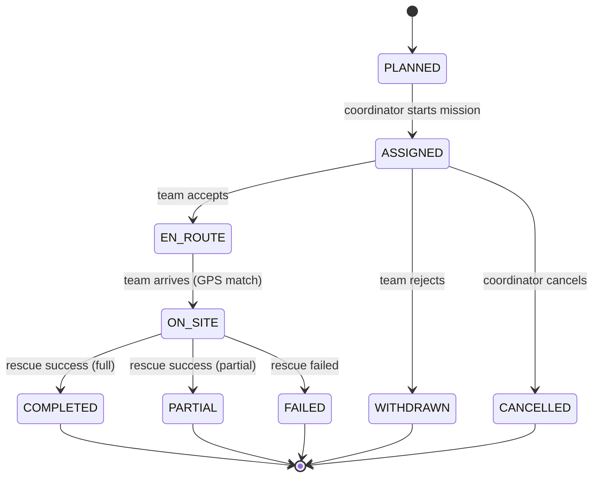
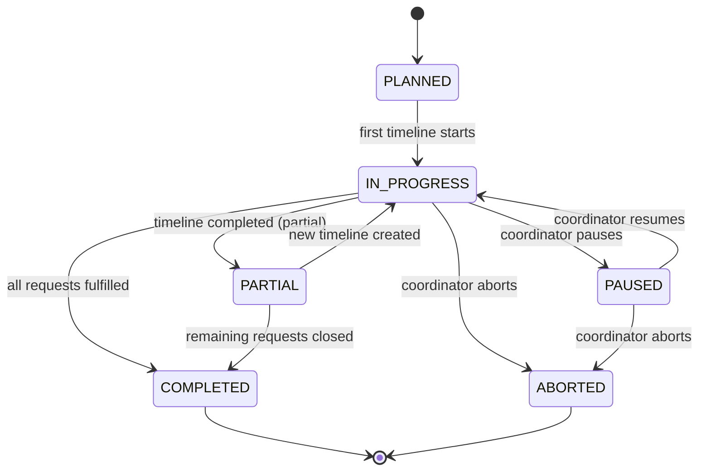
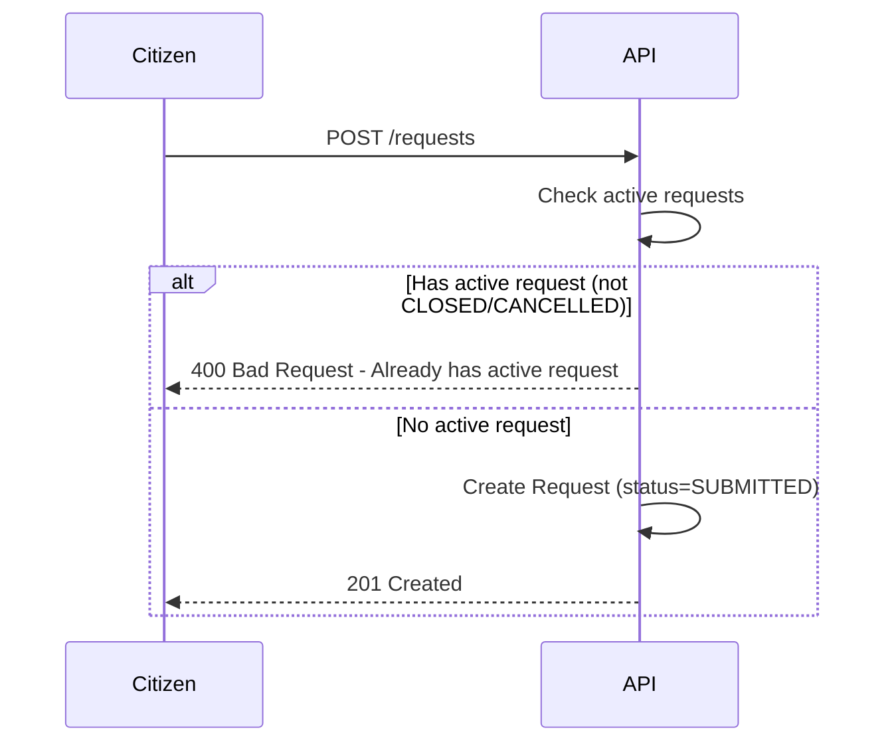
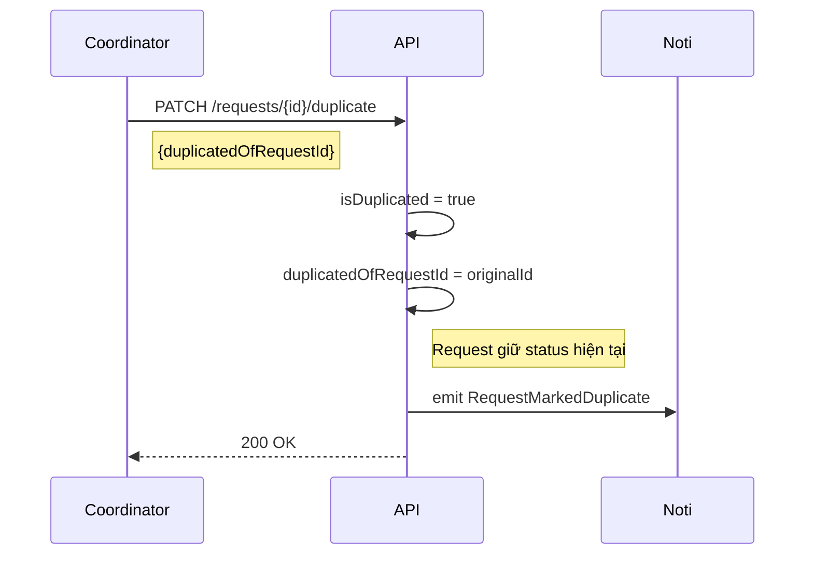
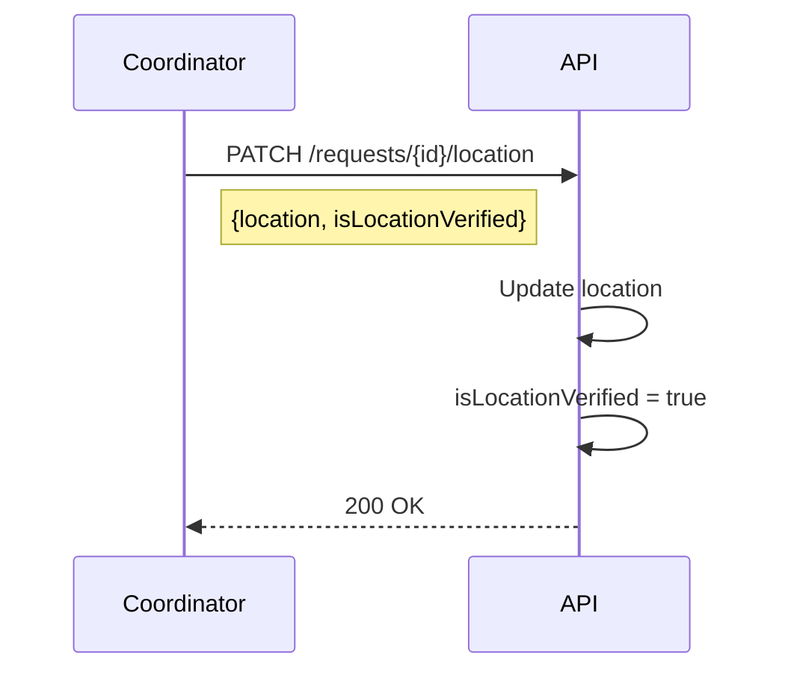
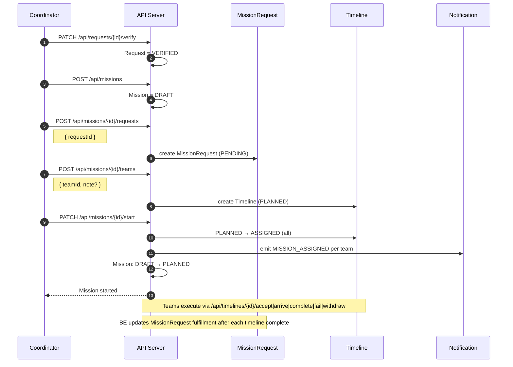

# Rescue Flow 2.2 (Redesigned — Multi-Request Mission)

> Phiên bản redesign với mô hình multi-request mission.
>
> **Changes v2.2 (redesign)**:
>
> - Mission khởi đầu ở `DRAFT` (coordinator đang lên kế hoạch; chưa notify).
> - Coordinator kéo Request vào mission → tạo `MissionRequest` (status=`PENDING`).
> - Coordinator ghép Team vào mission (không phải request) → tạo `Timeline` (status=`PLANNED`).
> - Coordinator bấm **Start Mission** → tất cả `PLANNED` Timeline → `ASSIGNED`; notification gửi tới từng team.
> - `Timeline` không còn `requestId` FK — Timeline đại diện cho team × mission.
> - `MissionRequest` theo dõi fulfillment (people + supply) cho từng request trong mission.

---

## Flowchart for Rescue Flow (Redesigned)

```mermaid
flowchart TD
    A[Citizen submits rescue request] --> B[Request status = SUBMITTED]

    B --> CANCEL_CHECK{Citizen cancel?}
    CANCEL_CHECK -- Yes --> CITIZEN_CANCELLED[Request = CANCELLED]
    CITIZEN_CANCELLED --> END_CANCEL[End]

    CANCEL_CHECK -- No --> VERIFY{Coordinator verifies?}
    VERIFY -- Reject --> REJ[Request = REJECTED → Notify Citizen]
    REJ --> END_REJ[End]

    VERIFY -- Verify OK --> VER[Request = VERIFIED]
    VER --> MISSION["Coordinator tạo Mission (status = DRAFT)"]

    MISSION --> ADD_REQ["Coordinator kéo Request vào Mission\nCreate MissionRequest (PENDING)"]
    ADD_REQ --> MORE_REQ{Thêm request khác?}
    MORE_REQ -- Yes --> ADD_REQ
    MORE_REQ -- No --> ASSIGN_TEAM["Coordinator ghép Team vào Mission\nCreate Timeline (PLANNED)"]

    ASSIGN_TEAM --> MORE_TEAM{Thêm team khác?}
    MORE_TEAM -- Yes --> ASSIGN_TEAM
    MORE_TEAM -- No --> START["Coordinator bấm Start Mission\nAll PLANNED → ASSIGNED\nMission: DRAFT → PLANNED\nNotify all Teams + Citizens"]

    START --> TEAM_RESPOND{Team responds?}
    TEAM_RESPOND -- Withdraw --> WITHDRAWN[Timeline = WITHDRAWN]
    WITHDRAWN --> REASSIGN[Coordinator assigns new team]
    ## State Diagrams (Redesigned)

    ### 1. Request State Diagram

    ```mermaid
    stateDiagram-v2
        [*] --> SUBMITTED

        SUBMITTED --> VERIFIED : coordinator verifies OK
        SUBMITTED --> REJECTED : coordinator rejects
        SUBMITTED --> CANCELLED : citizen cancels

        VERIFIED --> IN_PROGRESS : mission started, team accepts

        IN_PROGRESS --> PARTIALLY_FULFILLED : MissionRequest partial
        IN_PROGRESS --> FULFILLED : MissionRequest fulfilled

        PARTIALLY_FULFILLED --> IN_PROGRESS : new team assigned
        PARTIALLY_FULFILLED --> CLOSED : coordinator closes

        FULFILLED --> CLOSED

        REJECTED --> [*]
        CANCELLED --> [*]
        CLOSED --> [*]
    ```

    ### 2. MissionRequest State Diagram

    ```mermaid
    stateDiagram-v2
        [*] --> PENDING

        PENDING --> IN_PROGRESS : team accepts (timeline EN_ROUTE)
        IN_PROGRESS --> PARTIAL : timeline completed (partial)
        IN_PROGRESS --> FULFILLED : timeline completed (all rescued)

        PARTIAL --> IN_PROGRESS : new team accepts in same mission
        FULFILLED --> CLOSED : coordinator closes request
        PARTIAL --> CLOSED : coordinator closes manually

        PENDING --> DROPPED : coordinator removes request from mission
        IN_PROGRESS --> DROPPED : coordinator removes during execution

        CLOSED --> [*]
        DROPPED --> [*]
        FULFILLED --> [*]
    ```

    ### 3. Timeline State Diagram

    ```mermaid
    stateDiagram-v2
        [*] --> PLANNED

        PLANNED --> ASSIGNED : mission started (Start Mission)
        PLANNED --> CANCELLED : coordinator cancels before start

        ASSIGNED --> EN_ROUTE : team accepts
        ASSIGNED --> WITHDRAWN : team rejects
        ASSIGNED --> CANCELLED : coordinator cancels

        EN_ROUTE --> ON_SITE : team arrives

        ON_SITE --> COMPLETED : rescue success (full)
        ON_SITE --> PARTIAL : rescue success (partial)
        ON_SITE --> FAILED : rescue failed

        COMPLETED --> [*]
        PARTIAL --> [*]
        FAILED --> [*]
        WITHDRAWN --> [*]
        CANCELLED --> [*]
    ```

    ### 4. Mission State Diagram

    ```mermaid
    stateDiagram-v2
        [*] --> DRAFT

        DRAFT --> PLANNED : coordinator starts mission (notifications sent)
        PLANNED --> IN_PROGRESS : first team accepts (timeline EN_ROUTE)

        IN_PROGRESS --> PAUSED : coordinator pauses
        PAUSED --> IN_PROGRESS : coordinator resumes

        IN_PROGRESS --> PARTIAL : some MissionRequests partial
        PARTIAL --> IN_PROGRESS : new team added

        IN_PROGRESS --> COMPLETED : all MissionRequests fulfilled/closed
        PARTIAL --> COMPLETED : remaining closed manually

        IN_PROGRESS --> ABORTED : coordinator aborts
        PAUSED --> ABORTED : coordinator aborts

        COMPLETED --> [*]
        ABORTED --> [*]
    ```
        Coordinator ->> API: POST /missions
        API ->> API: create Mission (status=DRAFT)

        Note over Coordinator,API: Coordinator drags request(s) into mission board
        Coordinator ->> API: POST /missions/{id}/requests
        Note right of Coordinator: { requestId, note? }
        API ->> API: create MissionRequest (status=PENDING)<br/>peopleNeeded = Request.peopleCount
        API -->> Coordinator: MissionRequest created

        Note over Coordinator,API: Coordinator assigns team(s) to mission
        Coordinator ->> API: POST /missions/{id}/teams
        Note right of Coordinator: { teamId, note? }
        API ->> API: create Timeline (status=PLANNED)
        API -->> Coordinator: Timeline created

        %% -------------------------------------------------
        %% 3. Start Mission
        %% -------------------------------------------------
        Coordinator ->> API: PATCH /missions/{id}/start
        API ->> API: all PLANNED Timelines → ASSIGNED<br/>Mission: DRAFT → PLANNED
        API ->> Noti: emit MISSION_ASSIGNED → each Team + affected Citizens
        Noti ->> Team: New mission notification

        %% -------------------------------------------------
        %% 4. Team Execution
        %% -------------------------------------------------
        Team ->> API: PATCH /timelines/{id}/accept
        Note right of Team: { supplies?: [{supplyId, carriedQty}] }
        API ->> API: Timeline = EN_ROUTE, Mission = IN_PROGRESS
        API ->> Noti: emit MISSION_APPROACHING → Citizen

        loop GPS Updates
            Team ->> API: POST /positions
            API ->> Citizen: Realtime location (via socket)
        end

        Team ->> API: PATCH /timelines/{id}/arrive
        API ->> API: Timeline = ON_SITE

        %% -------------------------------------------------
        %% 5. Report + Fulfillment Update
        %% -------------------------------------------------
        alt Full Rescue
            Team ->> API: PATCH /timelines/{id}/complete
            Note right of Team: { rescuedCount, supplies?: [{distributedQty, returnedQty}] }
            API ->> API: Timeline = COMPLETED
            API ->> API: MissionRequest.peopleRescued += rescuedCount<br/>suppliesDelivered updated<br/>fulfillmentPercent recalculated
            API ->> API: if fulfilled → MissionRequest = FULFILLED<br/>Request = FULFILLED
            API ->> Noti: emit MISSION_COMPLETED → All
            Coordinator ->> API: PATCH /requests/{id}/close
            API ->> API: Request = CLOSED
        else Partial Rescue
            Team ->> API: PATCH /timelines/{id}/complete
            Note right of Team: partial result
            API ->> API: Timeline = PARTIAL
            API ->> API: MissionRequest = PARTIAL<br/>Request = PARTIALLY_FULFILLED
            Note over Coordinator: Assign more teams or close manually
        end
    ```
    IN_PROGRESS --> FULFILLED : timeline completed (full)

    PARTIALLY_FULFILLED --> IN_PROGRESS : new timeline created
    PARTIALLY_FULFILLED --> CLOSED : coordinator closes

    FULFILLED --> CLOSED

    REJECTED --> [*]
    CANCELLED --> [*]
    CLOSED --> [*]
```

### 2. Timeline State Diagram



### 3. Mission State Diagram



---

## Status Definitions

### Mission Status

| Status        | Meaning                                                                    |
| :------------ | :------------------------------------------------------------------------- |
| `DRAFT`       | Coordinator đang xây dựng kế hoạch — thêm requests, ghép teams            |
| `PLANNED`     | Start Mission đã được bấm; notifications gửi đến teams; chờ team accept   |
| `IN_PROGRESS` | Ít nhất 1 timeline đang EN_ROUTE hoặc ON_SITE                             |
| `PAUSED`      | Tạm dừng toàn bộ                                                           |
| `PARTIAL`     | Hoàn thành một phần (có MissionRequest chưa FULFILLED)                     |
| `COMPLETED`   | Tất cả MissionRequests đã FULFILLED hoặc CLOSED                           |
| `ABORTED`     | Huỷ mission                                                                |

### MissionRequest Status

| Status        | Meaning                                                                        |
| :------------ | :----------------------------------------------------------------------------- |
| `PENDING`     | Request đã vào mission, chưa có team nào accept                                |
| `IN_PROGRESS` | Có ít nhất 1 Timeline đang EN_ROUTE / ON_SITE cho request này trong mission    |
| `PARTIAL`     | Rescue hoàn thành nhưng không đủ (còn người hoặc supplies thiếu)               |
| `FULFILLED`   | Toàn bộ people rescued và supplies delivered đầy đủ                            |
| `CLOSED`      | Coordinator đóng thủ công                                                       |
| `DROPPED`     | Coordinator loại request khỏi mission                                           |

### Timeline Status

| Status      | Meaning                                                                              |
| :---------- | :----------------------------------------------------------------------------------- |
| `PLANNED`   | Team được ghép vào mission; mission chưa start; team **chưa được thông báo**        |
| `ASSIGNED`  | Mission đã start; team được thông báo; chờ team accept                              |
| `EN_ROUTE`  | Team accepted; đang di chuyển đến hiện trường                                       |
| `ON_SITE`   | Team đã đến và đang xử lý                                                           |
| `COMPLETED` | Hoàn thành toàn bộ                                                                  |
| `PARTIAL`   | Hoàn thành một phần                                                                 |
| `FAILED`    | Thất bại                                                                             |
| `WITHDRAWN` | Team từ chối sau khi được thông báo                                                 |
| `CANCELLED` | Coordinator huỷ trước khi team hành động                                            |

### Request Status

| Status                | Meaning                               |
| :-------------------- | :------------------------------------ |
| `VERIFIED`            | Đã xác minh, chờ vào Mission          |
| `IN_PROGRESS`         | Đang có team xử lý                    |
| `PARTIALLY_FULFILLED` | Đã cứu được một số, vẫn còn người kẹt |
| `FULFILLED`           | Đã cứu hết, chờ đóng hồ sơ            |
| `CLOSED`              | Hồ sơ đóng hoàn tất                   |

---

## Request Priority Rules

Khi Coordinator có nhiều Requests cần xử lý cùng lúc, ưu tiên theo thứ tự:

1. **Mức độ khẩn cấp (priority)** - _Coordinator gắn flag thủ công khi verify_
   - `CRITICAL` (High): Nguy hiểm tính mạng ngay lập tức
   - `HIGH` (Medium): Nguy cơ cao, chưa khẩn cấp tức thì
   - `NORMAL` (Low): Hỗ trợ khi có điều kiện

2. **Số người bị ảnh hưởng (peopleCount)**
   - Ưu tiên request có nhiều người hơn

3. **Thời gian tạo yêu cầu (createdAt)**
   - First-come-first-served nếu priority và peopleCount bằng nhau

---

## Validation & Duplicate Detection

### Request Creation Validation

**Rule:** Một Citizen chỉ được tạo Request mới khi request hiện tại đã ở terminal states (`CLOSED` hoặc `CANCELLED`).



### Duplicate Detection

Coordinator đánh dấu duplicate thủ công. _Future: Hệ thống đề xuất duplicate dựa trên location + time + citizen._



> **Note:** Request được đánh dấu duplicate vẫn được xử lý bình thường và có thể chuyển qua các status như request thông thường, nhưng sẽ được link với request gốc để tracking.

### Location Verification

Coordinator có thể cập nhật location và đánh dấu verified.



---

## API Endpoints Summary

| Method   | Endpoint                                     | Actor       | Description                                                           |
| :------- | :------------------------------------------- | :---------- | :-------------------------------------------------------------------- |
| `POST`   | `/requests`                                  | Citizen/Coord | Create request (1 active request limit)                             |
| `PATCH`  | `/requests/{id}/verify`                      | Coordinator | Verify request → `VERIFIED` / `REJECTED`                             |
| `PATCH`  | `/requests/{id}/close`                       | Coordinator | Close request → `CLOSED`                                             |
| `PATCH`  | `/requests/{id}/duplicate`                   | Coordinator | Mark as duplicate                                                     |
| `PATCH`  | `/requests/{id}/location`                    | Coordinator | Update location & verify                                             |
| `POST`   | `/missions`                                  | Coordinator | Create mission → status=`DRAFT`                                      |
| `GET`    | `/missions`                                  | Coordinator | List missions (filter by status, type)                               |
| `GET`    | `/missions/{id}`                             | Coordinator | Get mission detail                                                    |
| `PATCH`  | `/missions/{id}`                             | Coordinator | Update mission name/description/priority                             |
| `POST`   | `/missions/{id}/requests`                    | Coordinator | Add request to mission → create `MissionRequest` (PENDING)           |
| `DELETE` | `/missions/{id}/requests/{missionRequestId}` | Coordinator | Remove request from mission (PENDING/DROPPED only)                   |
| `GET`    | `/missions/{id}/requests`                    | Coordinator | List MissionRequests of this mission                                 |
| `POST`   | `/missions/{id}/teams`                       | Coordinator | Assign team to mission → create `Timeline` (PLANNED)                 |
| `PATCH`  | `/missions/{id}/start`                       | Coordinator | Start mission: all PLANNED → ASSIGNED + notify teams                 |
| `PATCH`  | `/missions/{id}/pause`                       | Coordinator | Pause mission                                                         |
| `PATCH`  | `/missions/{id}/resume`                      | Coordinator | Resume mission                                                        |
| `PATCH`  | `/missions/{id}/abort`                       | Coordinator | Abort mission → cancel all active timelines                          |
| `PATCH`  | `/timelines/{id}/accept`                     | Team        | Accept → `EN_ROUTE`; confirm supplies carried                        |
| `PATCH`  | `/timelines/{id}/arrive`                     | Team        | Arrive → `ON_SITE`                                                   |
| `PATCH`  | `/timelines/{id}/complete`                   | Team        | Finish with report → `COMPLETED` / `PARTIAL`; updates MissionRequest |
| `PATCH`  | `/timelines/{id}/fail`                       | Team        | Report failure → `FAILED`                                            |
| `PATCH`  | `/timelines/{id}/withdraw`                   | Team        | Withdraw → `WITHDRAWN`                                               |
| `PATCH`  | `/timelines/{id}/cancel`                     | Coordinator | Cancel timeline → `CANCELLED`                                        |

---

## Target Design Flow (Coordinator → Mission → Timeline)

Luồng mục tiêu sau khi redesign:

1. Coordinator verify Request → `PATCH /api/requests/{id}/verify` → Request: `VERIFIED`.
2. Coordinator tạo Mission → `POST /api/missions` → Mission: `DRAFT`.
3. Coordinator thêm Request(s) vào Mission → `POST /api/missions/{id}/requests` → tạo `MissionRequest (PENDING)`.
4. Coordinator ghép Team(s) vào Mission → `POST /api/missions/{id}/teams` → tạo `Timeline (PLANNED)`.
5. Coordinator bấm Start → `PATCH /api/missions/{id}/start` → tất cả Timeline `PLANNED → ASSIGNED`; Mission `DRAFT → PLANNED`; notify teams.
6. Team thao tác lifecycle: `PATCH /api/timelines/{id}/accept|arrive|complete|fail|withdraw`.
7. Sau mỗi `complete`, BE cập nhật `MissionRequest.peopleRescued`, `suppliesDelivered`, `fulfillmentPercent`.
8. Coordinator/Admin huỷ timeline: `PATCH /api/timelines/{id}/cancel`.
9. Coordinator abort mission: `PATCH /api/missions/{id}/abort` → huỷ tất cả active timelines; emit `MISSION_ABORTED`.

### Validation Rules

- Mission phải ở `DRAFT` để thêm requests và ghép teams.
- Mission phải có ít nhất 1 Timeline `PLANNED` để có thể Start.
- Một Request chỉ được thêm vào Mission một lần (unique missionId + requestId trong MissionRequest).
- Một Team có thể được assign vào Mission nhiều lần (sau WITHDRAWN/CANCELLED).
- Start Mission không cho phép khi mission không ở `DRAFT`.

### Sequence (Target Design)



---

## References

- [rules.md](./rules.md) - Unified Derivation Rules (Single Source of Truth)
- [ERD.md](../ERD.md) - Entity definitions and data model

---

## Implementation Notes (Target Design)

- Timeline status lifecycle (target): `PLANNED` → `ASSIGNED` → `EN_ROUTE` → `ON_SITE` → `COMPLETED` / `PARTIAL` / `FAILED`; or `WITHDRAWN` / `CANCELLED`.
- Timeline APIs (target additions): `POST /api/missions/{id}/requests`, `POST /api/missions/{id}/teams`, `PATCH /api/missions/{id}/start`.
- Notification trigger points (target):
    - `MISSION_ASSIGNED` on `PATCH /api/missions/{id}/start` (per team)
    - `MISSION_APPROACHING` on timeline `accept` (`EN_ROUTE`)
    - `MISSION_COMPLETED` on timeline `complete` (when MissionRequest becomes FULFILLED)
    - `MISSION_FAILED` on timeline `fail`
    - `MISSION_ABORTED` on `PATCH /api/missions/{id}/abort`
- `MissionRequest.fulfillmentPercent` recalculated after every timeline `complete` within same mission.
