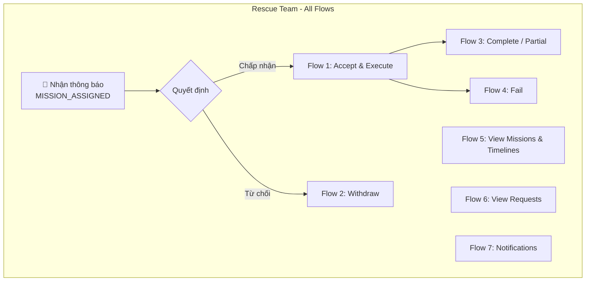
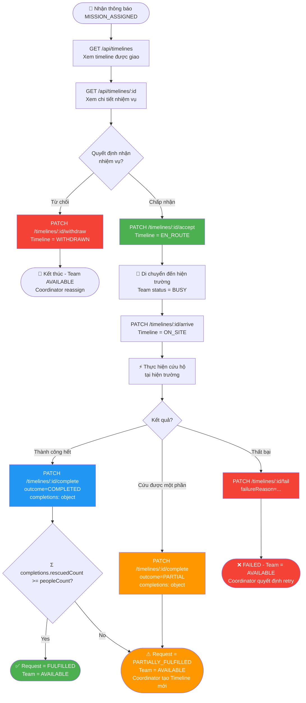
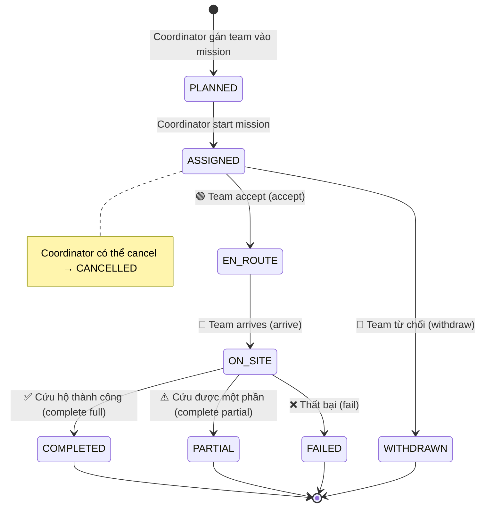
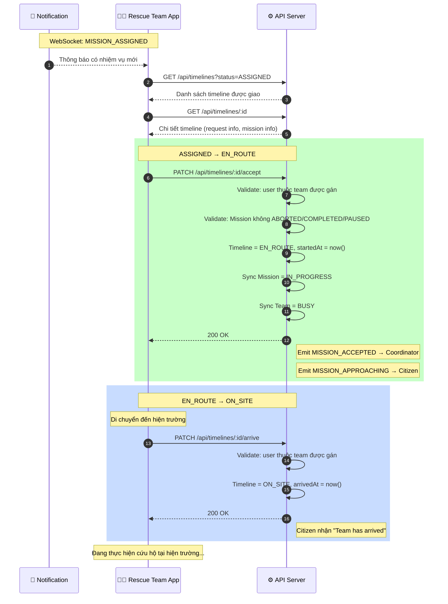
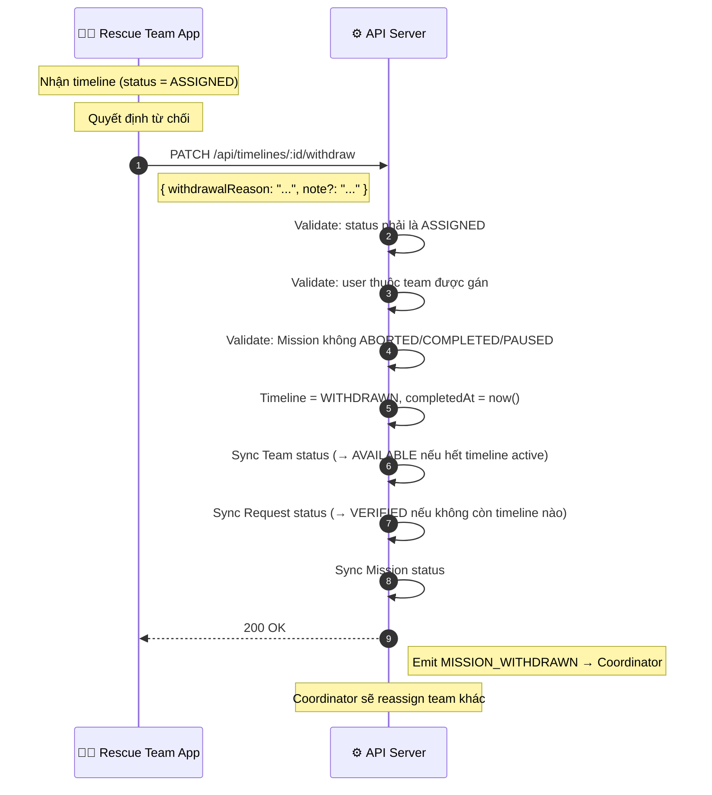
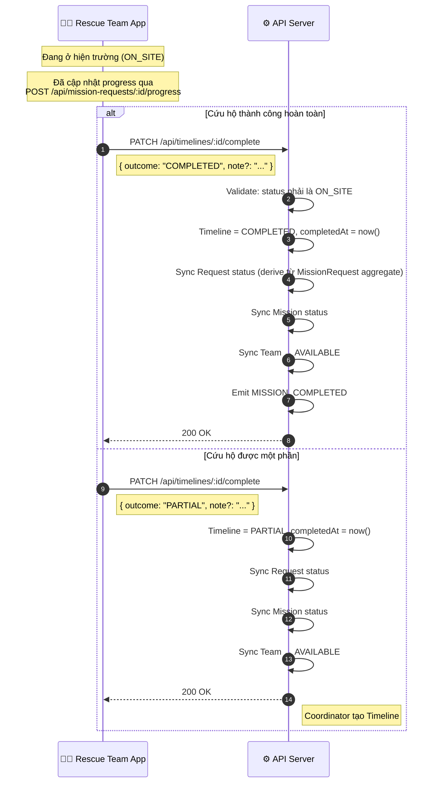
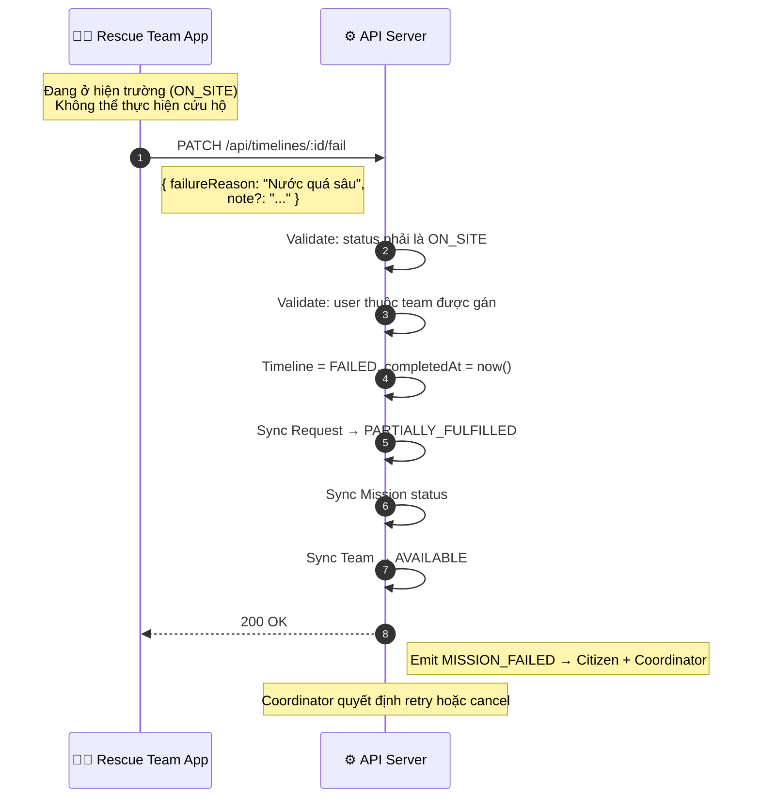
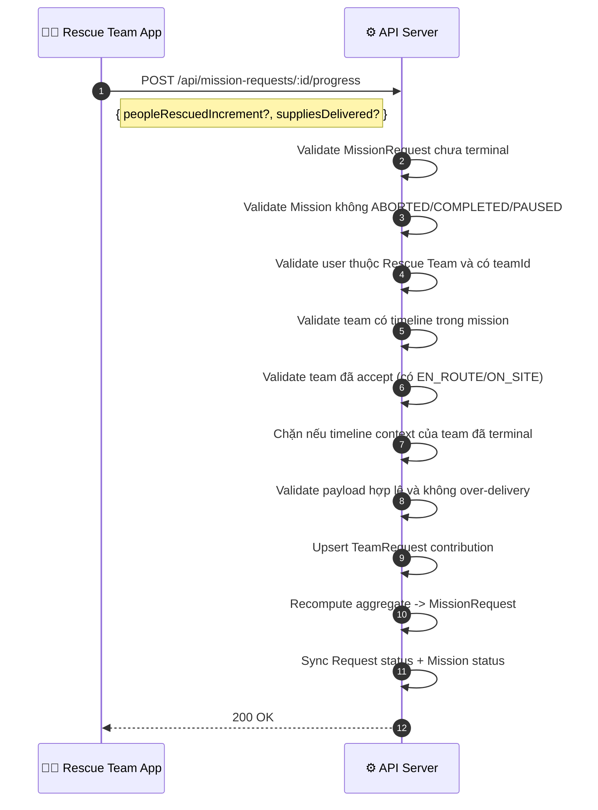
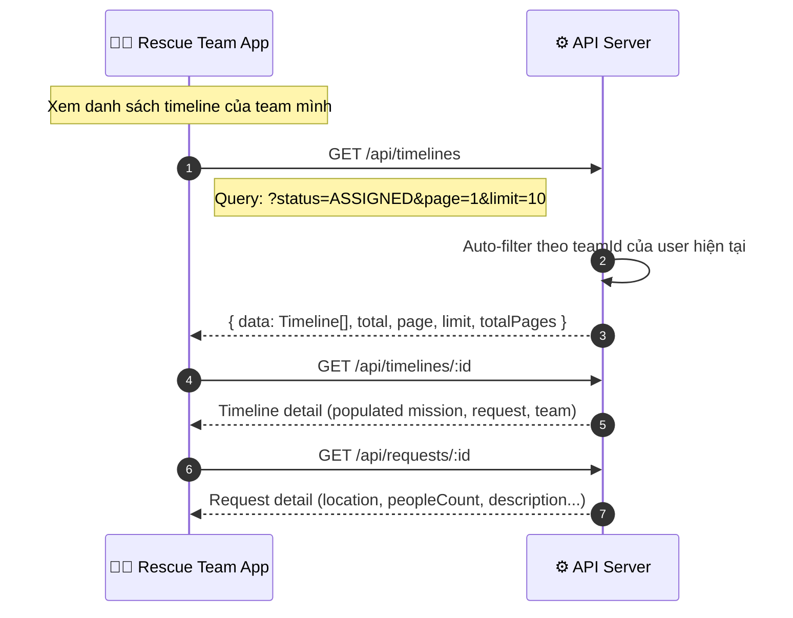
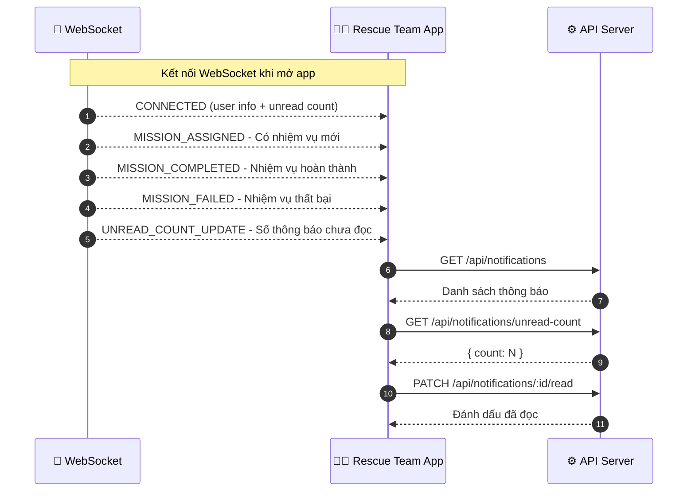

# Rescue Team Flows

> Tổng hợp tất cả các luồng dành cho actor **Rescue Team**.
>
> Dựa trên [Rescue_flow_2.2.md](./Rescue_flow_2.2.md), [Relief_flow_1.1.md](./Relief_flow_1.1.md) và source code hiện tại.

> **V2 update (TeamRequest-first, Option A):**
>
> - Khi `PATCH /api/missions/:id/start`, hệ thống pre-create `TeamRequest` cho mọi cặp (`MissionRequest` x Team assigned).
> - Sau `start`, mission vẫn ở `PLANNED`; mission chỉ chuyển `IN_PROGRESS` khi có ít nhất một timeline vào `EN_ROUTE`/`ON_SITE` (thường sau `accept`).
> - Team update tiến độ qua `POST /api/mission-requests/:id/progress`, backend ghi audit theo TeamRequest và sync aggregate về MissionRequest.
> - Team chỉ được update progress khi đã `accept` (có timeline đang executing: `EN_ROUTE`/`ON_SITE`).
> - Team có thể xem request trong mission ngay sau khi được assign (không phụ thuộc đã update progress hay chưa).
> - Nếu tổng `suppliesDelivered` vượt `requestedQty`, API trả lỗi `422 (SUPPLY_OVER_DELIVERY)` để FE hiển thị cảnh báo nghiệp vụ.

---

## 1. Tổng quan luồng chính

---

## 2. Full End-to-End Flow

Luồng toàn bộ từ khi nhận thông báo đến khi kết thúc nhiệm vụ:

---

## 3. Timeline State Machine (Rescue Team perspective)

---

## 4. Flow chi tiết

### 4.1 Accept & Execute (Nhận và thực thi nhiệm vụ)

### 4.2 Withdraw (Từ chối nhiệm vụ)

### 4.3 Complete / Partial (Hoàn thành nhiệm vụ)

> **Lưu ý:** Team phải cập nhật tiến độ (rescued/supply) qua `POST /api/mission-requests/:id/progress` **trước** khi gọi complete. API complete chỉ chuyển trạng thái timeline, không ghi rescuedCount.

### 4.4 Fail (Thất bại)

### 4.5 Update Progress theo MissionRequest (TeamRequest-first)

### 4.6 View Missions & Timelines (Xem nhiệm vụ)

### 4.7 Notifications (Thông báo)

---

## 5. Validation & Guards

Mỗi action của Rescue Team đều phải qua các validation sau:

| Check | Mô tả | HTTP Error |
|:------|:-------|:-----------|
| **Authentication** | User phải đăng nhập (JWT) | `401` |
| **Authorization** | User phải có role `Rescue Team` | `403` |
| **Team membership** | User phải thuộc team được gán trong timeline | `403` |
| **Mission status (timeline actions)** | `accept`, `arrive`, `complete`, `fail`, `withdraw` đều chặn khi mission ở `ABORTED`, `COMPLETED`, `PAUSED` | `400` |
| **Progress precondition** | Team phải `accept` trước khi update progress (cần timeline `EN_ROUTE`/`ON_SITE`) | `400` |
| **Progress terminal guard** | Không cho update progress khi timeline context của team đã terminal | `400` |
| **Timeline transition** | Status hiện tại phải hợp lệ cho action | `400` |
| **Supply over-delivery** | Tổng deliveredQty của supply vượt requestedQty trong MissionRequest snapshot | `422` |
| **Concurrent guard (timeline only)** | `transitionStatus` tránh race condition cho timeline actions | `409` |

---

## 6. Side Effects (Auto-sync)

Khi Rescue Team thực hiện action trên Timeline, hệ thống tự động sync:

| Action | Timeline | Request | Mission | Team | Events |
|:-------|:---------|:--------|:--------|:-----|:-------|
| `accept` | → EN_ROUTE | MissionRequest `PENDING` → `IN_PROGRESS`; Request → `IN_PROGRESS` | → IN_PROGRESS | → BUSY | MISSION_ACCEPTED, MISSION_APPROACHING |
| `arrive` | → ON_SITE | — | — | — | — |
| `complete` (full) | → COMPLETED | Sync Request từ MissionRequest aggregate (FULFILLED / PARTIALLY_FULFILLED) | → COMPLETED / PARTIAL | → AVAILABLE | MISSION_COMPLETED |
| `complete` (partial) | → PARTIAL | Sync Request từ MissionRequest aggregate | → PARTIAL | → AVAILABLE | — |
| `fail` | → FAILED | → PARTIALLY_FULFILLED | sync | → AVAILABLE | MISSION_FAILED |
| `withdraw` | → WITHDRAWN | → VERIFIED (nếu hết timeline) | sync | → AVAILABLE | MISSION_WITHDRAWN |
| `missionRequest progress update` | — | MissionRequest aggregate cập nhật từ TeamRequest; Request có thể thành PARTIALLY_FULFILLED khi all terminal nhưng còn thiếu target | sync PARTIAL/COMPLETED | — | — |

---

## 7. API Endpoints Summary

| # | Method | Endpoint | Action | Body |
|:--|:-------|:---------|:-------|:-----|
| 1 | `GET` | `/api/timelines` | Danh sách timeline (auto-filter theo team) | Query: `status`, `missionId`, `page`, `limit` |
| 2 | `GET` | `/api/timelines/:id` | Chi tiết timeline | — |
| 3 | `PATCH` | `/api/timelines/:id/accept` | Nhận nhiệm vụ (ASSIGNED → EN_ROUTE) | — |
| 4 | `PATCH` | `/api/timelines/:id/arrive` | Đã đến nơi (EN_ROUTE → ON_SITE) | — |
| 5 | `POST` | `/api/team-requests/:id/complete` | **[NEW]** Hoàn thành TeamRequest (recommended). Outcome tự động xác định dựa trên rescued count vs target. Auto-complete Timeline nếu là TeamRequest cuối cùng. | `{ note? }` |
| 6 | `PATCH` | `/api/timelines/:id/complete` | **[DEPRECATED]** Hoàn thành Timeline (cách cũ, vẫn hoạt động). Team phải cập nhật progress trước khi complete. | `{ outcome, note? }` |
| 7 | `PATCH` | `/api/timelines/:id/fail` | Thất bại (ON_SITE → FAILED) | `{ failureReason, note? }` |
| 8 | `PATCH` | `/api/timelines/:id/withdraw` | Từ chối (ASSIGNED → WITHDRAWN) | `{ withdrawalReason, note? }` |
| 9 | `GET` | `/api/requests` | Xem danh sách requests | Query: `status`, `type`, `page`, `limit` |
| 10 | `GET` | `/api/requests/:id` | Xem chi tiết request | — |
| 11 | `GET` | `/api/missions/:id/requests` | Xem requests trong mission (team view + supervisor filter) | Query: `teamId`, `page`, `limit` |
| 12 | `POST` | `/api/mission-requests/:id/progress` | Team cập nhật rescued/supply cho request | `{ peopleRescuedIncrement?, suppliesDelivered? }` |
| 13 | `GET` | `/api/team-requests` | Xem audit TeamRequest (team chỉ thấy team của mình) | Query: `missionId`, `missionRequestId`, `teamId`, `page`, `limit` |
| 14 | `GET` | `/api/team-requests/:id` | Xem chi tiết một TeamRequest | — |
| 15 | `GET` | `/api/notifications` | Danh sách thông báo | — |
| 16 | `PATCH` | `/api/notifications/:id/read` | Đánh dấu đã đọc | — |
| 17 | `GET` | `/api/notifications/unread-count` | Số thông báo chưa đọc | — |

---

## 8. TeamRequest Audit Model (Option A)

`TeamRequest` là join entity giữa Team và MissionRequest để xử lý quan hệ nhiều-nhiều có audit rõ ràng.

### 8.1 Option A pre-create matrix

- Khi mission start thành công, hệ thống tạo trước TeamRequest cho mọi cặp:
    - mỗi `MissionRequest` trong mission
    - mỗi team có `Timeline` thuộc mission ở trạng thái `ASSIGNED`
- Dùng unique key `(missionRequestId, teamId)` để chống duplicate khi retry.

### 8.2 TeamRequest fields chính

- `missionId`
- `missionRequestId`
- `teamId`
- `rescuedCountTotal`
- `suppliesDeliveredTotal[]`
- `lastUpdatedAt`
- `lastUpdatedBy` (optional)
- **[NEW]** `completedAt` — Thời điểm team complete TeamRequest này
- **[NEW]** `completedBy` — User ID của người complete
- **[NEW]** `outcome` — `COMPLETED` hoặc `PARTIAL` (auto-determined)
- **[NEW]** `note` — Ghi chú khi complete

### 8.3 TeamRequest Complete Flow (NEW - Recommended)

**Endpoint:** `POST /api/team-requests/:id/complete`

**Luồng:**
1. Team gọi progress endpoint để cập nhật `rescuedCountTotal` và `suppliesDeliveredTotal`
2. Team gọi complete endpoint cho từng TeamRequest riêng biệt
3. Hệ thống tự động xác định outcome:
   - `rescuedCountTotal >= peopleNeeded` → `COMPLETED`
   - `rescuedCountTotal < peopleNeeded` → `PARTIAL`
4. Đánh dấu TeamRequest với `completedAt`, `completedBy`, `outcome`, `note`
5. Kiểm tra xem còn TeamRequest nào chưa complete của team trong mission không
6. Nếu đây là TeamRequest cuối cùng → tự động complete Timeline với outcome tương ứng
7. Sync MissionRequest/Request/Mission statuses

**Validations:**
- TeamRequest chưa được complete trước đó
- User phải thuộc team của TeamRequest
- Timeline phải ở trạng thái `ON_SITE`
- Team phải có Timeline trong mission

**Ưu điểm so với Timeline complete:**
- Outcome tự động xác định dựa trên data thực tế
- Team complete từng request riêng biệt (granular control)
- Timeline tự động complete khi tất cả TeamRequest xong
- Audit rõ ràng hơn (biết team complete request nào, khi nào)
- Multi-team scenario: team khác vẫn có thể tiếp tục với TeamRequest riêng của họ

### 8.4 Derivation rule

- Team ghi contribution vào TeamRequest.
- MissionRequest aggregate (`peopleRescued`, `suppliesDelivered`, `fulfillmentPercent`) = tổng contribution của tất cả TeamRequest cùng `missionRequestId`.
- TeamRequest không có state machine riêng; trạng thái vận hành dùng `Timeline.status` làm source of truth.
- Progress endpoint dùng path chuẩn: `POST /api/mission-requests/:id/progress`.
- Progress không cho phép trước `accept`; team cần đang có timeline `EN_ROUTE`/`ON_SITE` trong mission.
- Nếu over-delivery supply, API trả `422 SUPPLY_OVER_DELIVERY`.
- **Auto-close behavior**:
    - Khi MissionRequest đạt 100% fulfillment → tự động chuyển sang `CLOSED` (không qua `FULFILLED`).
    - Emit event `REQUEST_AUTO_CLOSED` để notify Coordinator và Citizen.
    - Team khác cố update progress trên request đã `CLOSED` → nhận `200 OK` với message `"Mission already completed"`, không ghi data.
- Request final status:
    - `FULFILLED` nếu tất cả MissionRequest đều `CLOSED` và đủ target.
    - `PARTIALLY_FULFILLED` nếu kết thúc mà chưa đủ target.

---

## References

- [Rescue_flow_2.2.md](./Rescue_flow_2.2.md) — Rescue Flow chính thức
- [Relief_flow_1.1.md](./Relief_flow_1.1.md) — Relief Flow (cùng Timeline lifecycle)
- [rules.md](./rules.md) — Unified Derivation Rules
