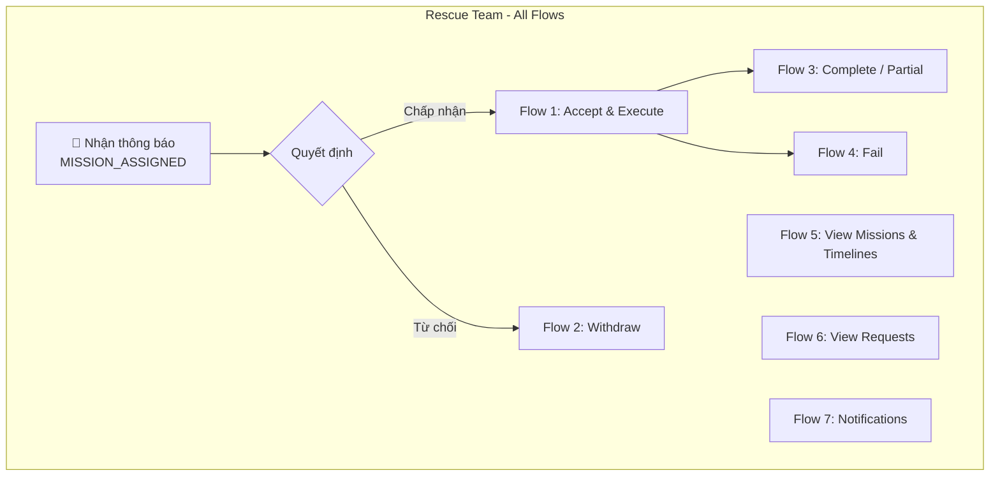
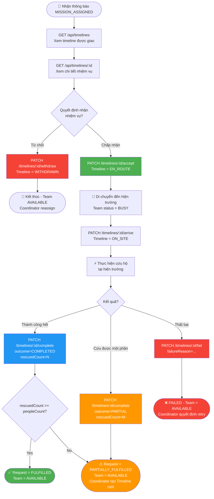
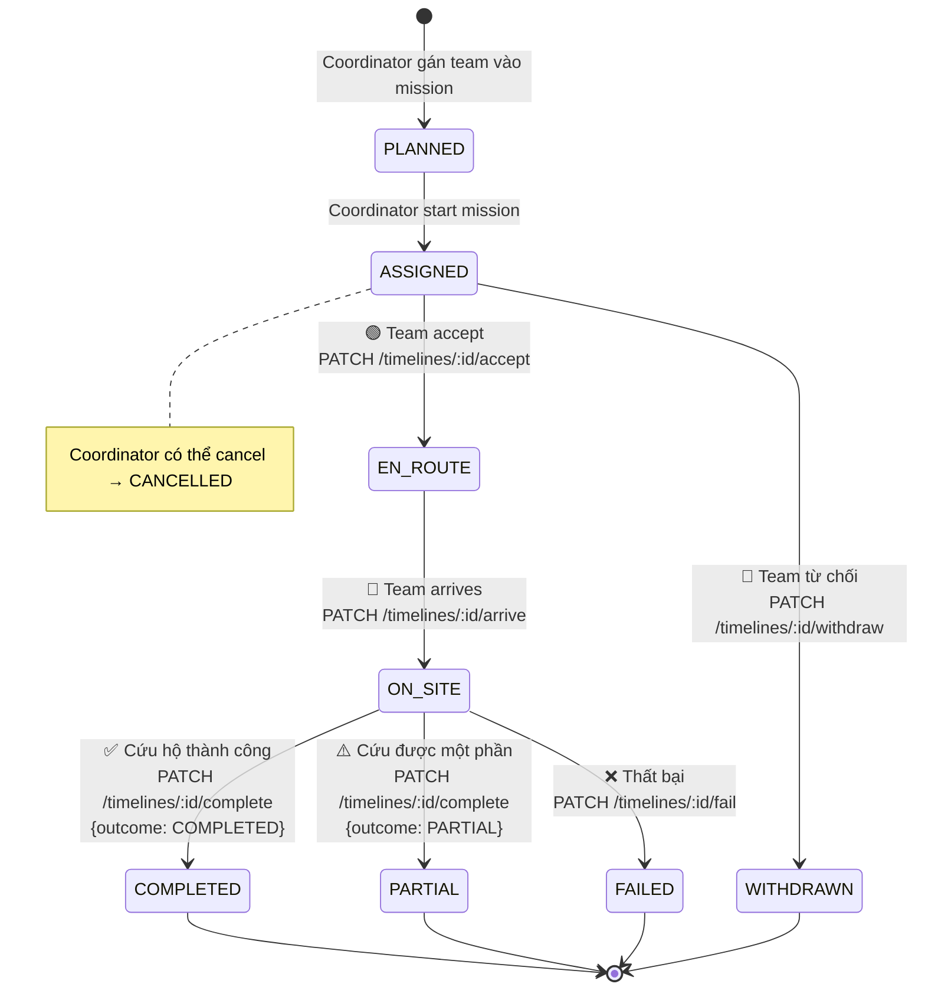
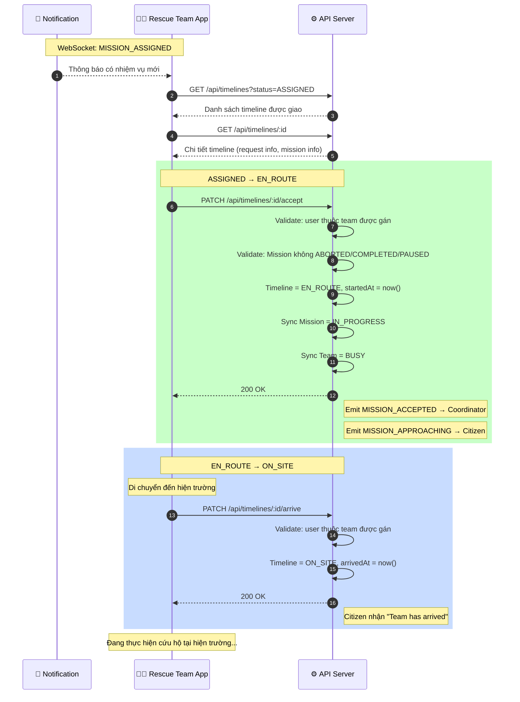
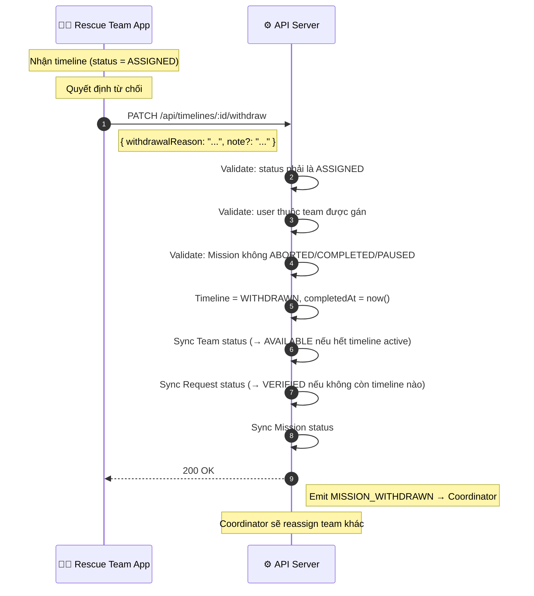
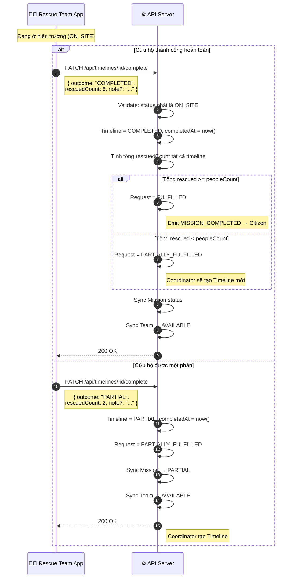
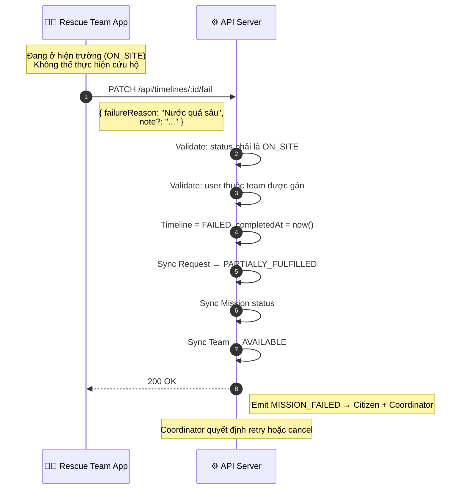
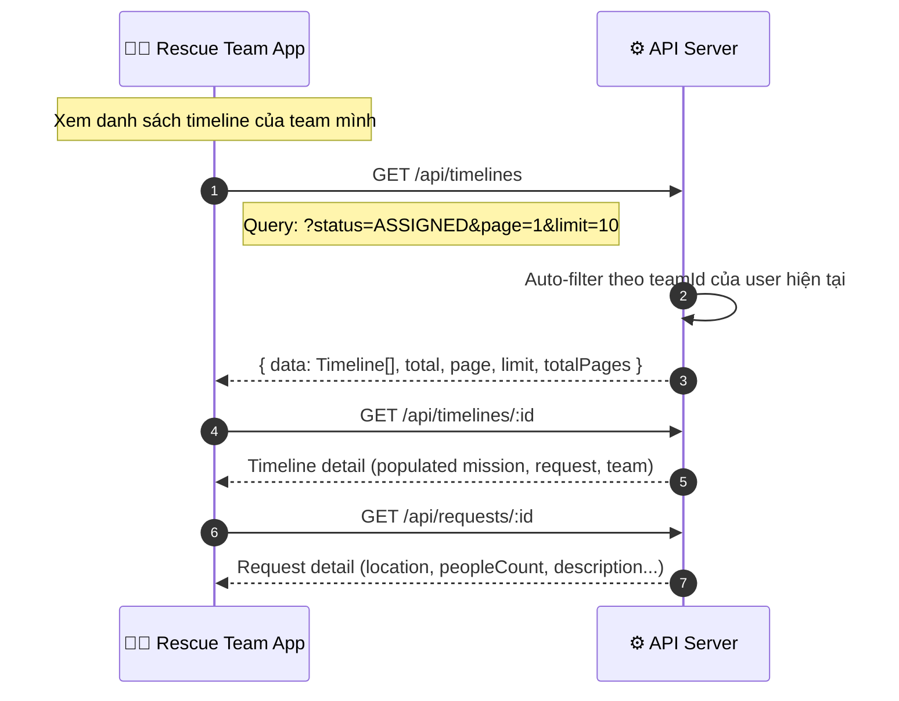
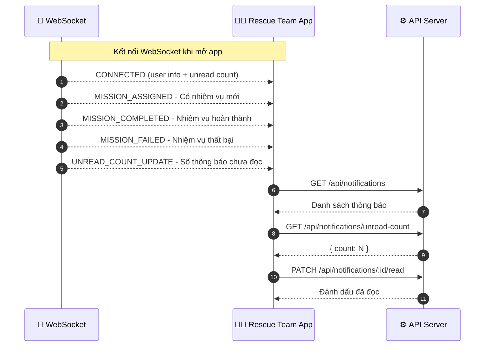

# Rescue Team Flows

> Tổng hợp tất cả các luồng dành cho actor **Rescue Team**.
>
> Dựa trên [Rescue_flow_2.2.md](./Rescue_flow_2.2.md), [Relief_flow_1.1.md](./Relief_flow_1.1.md) và source code hiện tại.

---

## 1. Tổng quan luồng chính

---

## 2. Full End-to-End Flow

Luồng toàn bộ từ khi nhận thông báo đến khi kết thúc nhiệm vụ:

---

## 3. Timeline State Machine (Rescue Team perspective)

---

## 4. Flow chi tiết

### 4.1 Accept & Execute (Nhận và thực thi nhiệm vụ)

### 4.2 Withdraw (Từ chối nhiệm vụ)

### 4.3 Complete / Partial (Hoàn thành nhiệm vụ)

### 4.4 Fail (Thất bại)

### 4.5 View Missions & Timelines (Xem nhiệm vụ)

### 4.6 Notifications (Thông báo)

---

## 5. Validation & Guards

Mỗi action của Rescue Team đều phải qua các validation sau:

| Check | Mô tả | HTTP Error |
|:------|:-------|:-----------|
| **Authentication** | User phải đăng nhập (JWT) | `401` |
| **Authorization** | User phải có role `Rescue Team` | `403` |
| **Team membership** | User phải thuộc team được gán trong timeline | `403` |
| **Mission status** | Mission không được ở `ABORTED`, `COMPLETED`, `PAUSED` | `400` |
| **Timeline transition** | Status hiện tại phải hợp lệ cho action | `400` |
| **Concurrent guard** | Sử dụng `transitionStatus` để tránh race condition | `409` |

---

## 6. Side Effects (Auto-sync)

Khi Rescue Team thực hiện action trên Timeline, hệ thống tự động sync:

| Action | Timeline | Request | Mission | Team | Events |
|:-------|:---------|:--------|:--------|:-----|:-------|
| `accept` | → EN_ROUTE | → IN_PROGRESS | → IN_PROGRESS | → BUSY | MISSION_ACCEPTED, MISSION_APPROACHING |
| `arrive` | → ON_SITE | — | — | — | — |
| `complete` (full) | → COMPLETED | → FULFILLED (nếu đủ) | → COMPLETED / PARTIAL | → AVAILABLE | MISSION_COMPLETED |
| `complete` (partial) | → PARTIAL | → PARTIALLY_FULFILLED | → PARTIAL | → AVAILABLE | — |
| `fail` | → FAILED | → PARTIALLY_FULFILLED | sync | → AVAILABLE | MISSION_FAILED |
| `withdraw` | → WITHDRAWN | → VERIFIED (nếu hết timeline) | sync | → AVAILABLE | MISSION_WITHDRAWN |

---

## 7. API Endpoints Summary

| # | Method | Endpoint | Action | Body |
|:--|:-------|:---------|:-------|:-----|
| 1 | `GET` | `/api/timelines` | Danh sách timeline (auto-filter theo team) | Query: `status`, `missionId`, `page`, `limit` |
| 2 | `GET` | `/api/timelines/:id` | Chi tiết timeline | — |
| 3 | `PATCH` | `/api/timelines/:id/accept` | Nhận nhiệm vụ (ASSIGNED → EN_ROUTE) | — |
| 4 | `PATCH` | `/api/timelines/:id/arrive` | Đã đến nơi (EN_ROUTE → ON_SITE) | — |
| 5 | `PATCH` | `/api/timelines/:id/complete` | Hoàn thành (ON_SITE → COMPLETED/PARTIAL) | `{ outcome, rescuedCount, note? }` |
| 6 | `PATCH` | `/api/timelines/:id/fail` | Thất bại (ON_SITE → FAILED) | `{ failureReason, note? }` |
| 7 | `PATCH` | `/api/timelines/:id/withdraw` | Từ chối (ASSIGNED → WITHDRAWN) | `{ withdrawalReason, note? }` |
| 8 | `GET` | `/api/requests` | Xem danh sách requests | Query: `status`, `type`, `page`, `limit` |
| 9 | `GET` | `/api/requests/:id` | Xem chi tiết request | — |
| 10 | `GET` | `/api/notifications` | Danh sách thông báo | — |
| 11 | `PATCH` | `/api/notifications/:id/read` | Đánh dấu đã đọc | — |
| 12 | `GET` | `/api/notifications/unread-count` | Số thông báo chưa đọc | — |

---

## References

- [Rescue_flow_2.2.md](./Rescue_flow_2.2.md) — Rescue Flow chính thức
- [Relief_flow_1.1.md](./Relief_flow_1.1.md) — Relief Flow (cùng Timeline lifecycle)
- [rules.md](./rules.md) — Unified Derivation Rules
